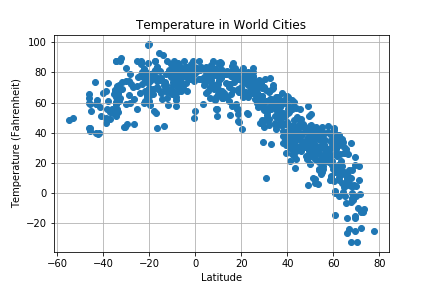

# WeatherPy
GWU Data Analytics Bootcamp Homework 6

### Observations

* Temperature maximizes as latitude approaches 0
* Because latitude is 0 at the Equator, this means that temperature is typically highest at or near the Equator
* There does not seem to be a correlation between latitude and cloudiness, humidity, or wind speed


```python
# Read in Dependencies

import random
from citipy import citipy
import pandas as pd
import openweathermapy.core as owm
from config import api_key
import matplotlib.pyplot as plt
```

### Generate Cities List


```python
# Set possible ranges for latitude (x) and longitude (y)

xRange = (-55, 80)
yRange = (-180, 180)

# Create a place to put latitude-longitude pairs

randpoints = []

# Create a list of 2,000 latitude-longitude pairs

while len(randpoints) < 2000:
    x = random.randrange(*xRange)
    y = random.randrange(*yRange)
    if (x, y) not in randpoints:
        randpoints.append((x,y))

# Create a place to hold city data
        
cities = []

# Create a list of City objects from latitude-longitude pairs

for coordinate_pair in randpoints:
    lat, lon = coordinate_pair
    if citipy.nearest_city(lat, lon) not in cities:
        cities.append(citipy.nearest_city(lat, lon))

# Create a place to hold city names
        
names = []

# Create a list of city names from City objects

for city in cities:
    if city.city_name not in names:
        names.append(city.city_name)
```

### Perform API Calls


```python
# Create base settings for API calls

settings = {"units": "imperial", "appid": api_key}

# Create places to hold data from iterations and initiate iteration counter

name_list = []
latitude = []
temperature = []
humidity = []
cloudiness = []
wind_speed = []
i = 0

# Run API calls and collect data

for name in names:
    try:
        current_weather = owm.get_current(name, **settings)
        name_list.append(current_weather['name'])
        latitude.append(current_weather['coord']['lat'])
        temperature.append(current_weather['main']['temp'])
        humidity.append(current_weather['main']['humidity'])
        cloudiness.append(current_weather['clouds']['all'])
        wind_speed.append(current_weather['wind']['speed'])
        url = "http://api.openweathermap.org/data/2.5/weather?appid=xxxxx&units=imperial&q=" + name.replace(" ","%20")
        i = i + 1
        print(f"Record {i} for {current_weather['name']} accessed at:")
        print(url)
        print("")
    except: 
        pass
```

    Record 1 for Puerto Ayora accessed at:
    http://api.openweathermap.org/data/2.5/weather?appid=xxxxx&units=imperial&q=puerto%20ayora
    
    Record 2 for Pisco accessed at:
    http://api.openweathermap.org/data/2.5/weather?appid=xxxxx&units=imperial&q=pisco
    
    Record 3 for Biltine accessed at:
    http://api.openweathermap.org/data/2.5/weather?appid=xxxxx&units=imperial&q=biltine
    
    Record 4 for Seymour accessed at:
    http://api.openweathermap.org/data/2.5/weather?appid=xxxxx&units=imperial&q=seymour
    
    Record 5 for Brokopondo accessed at:
    http://api.openweathermap.org/data/2.5/weather?appid=xxxxx&units=imperial&q=brokopondo
    
    Record 6 for Dir accessed at:
    http://api.openweathermap.org/data/2.5/weather?appid=xxxxx&units=imperial&q=dir
    
    Record 7 for Whitehorse accessed at:
    http://api.openweathermap.org/data/2.5/weather?appid=xxxxx&units=imperial&q=whitehorse
    
    Record 8 for Alta Floresta accessed at:
    http://api.openweathermap.org/data/2.5/weather?appid=xxxxx&units=imperial&q=alta%20floresta
    
    Record 9 for Dunmore East accessed at:
    http://api.openweathermap.org/data/2.5/weather?appid=xxxxx&units=imperial&q=dunmore%20east
    
    Record 10 for Atambua accessed at:
    http://api.openweathermap.org/data/2.5/weather?appid=xxxxx&units=imperial&q=atambua
    
    Record 11 for Fort Nelson accessed at:
    http://api.openweathermap.org/data/2.5/weather?appid=xxxxx&units=imperial&q=fort%20nelson
    
    Record 12 for Ponta do Sol accessed at:
    http://api.openweathermap.org/data/2.5/weather?appid=xxxxx&units=imperial&q=ponta%20do%20sol
    
    Record 13 for Moerai accessed at:
    http://api.openweathermap.org/data/2.5/weather?appid=xxxxx&units=imperial&q=moerai
    
    Record 14 for Avarua accessed at:
    http://api.openweathermap.org/data/2.5/weather?appid=xxxxx&units=imperial&q=avarua
    
    Record 15 for Anadyr accessed at:
    http://api.openweathermap.org/data/2.5/weather?appid=xxxxx&units=imperial&q=anadyr
    
    Record 16 for Nikolskoye accessed at:
    http://api.openweathermap.org/data/2.5/weather?appid=xxxxx&units=imperial&q=nikolskoye
    
    Record 17 for New Norfolk accessed at:
    http://api.openweathermap.org/data/2.5/weather?appid=xxxxx&units=imperial&q=new%20norfolk
    
    Record 18 for Vilhena accessed at:
    http://api.openweathermap.org/data/2.5/weather?appid=xxxxx&units=imperial&q=vilhena
    
    Record 19 for Galyugayevskaya accessed at:
    http://api.openweathermap.org/data/2.5/weather?appid=xxxxx&units=imperial&q=galyugayevskaya
    
    Record 20 for Geraldton accessed at:
    http://api.openweathermap.org/data/2.5/weather?appid=xxxxx&units=imperial&q=geraldton
    
    Record 21 for Levelek accessed at:
    http://api.openweathermap.org/data/2.5/weather?appid=xxxxx&units=imperial&q=levelek
    
    Record 22 for Mataura accessed at:
    http://api.openweathermap.org/data/2.5/weather?appid=xxxxx&units=imperial&q=mataura
    
    Record 23 for Hobart accessed at:
    http://api.openweathermap.org/data/2.5/weather?appid=xxxxx&units=imperial&q=hobart
    
    Record 24 for Vila Velha accessed at:
    http://api.openweathermap.org/data/2.5/weather?appid=xxxxx&units=imperial&q=vila%20velha
    
    Record 25 for Chililabombwe accessed at:
    http://api.openweathermap.org/data/2.5/weather?appid=xxxxx&units=imperial&q=chililabombwe
    
    Record 26 for Portobelo accessed at:
    http://api.openweathermap.org/data/2.5/weather?appid=xxxxx&units=imperial&q=portobelo
    
    Record 27 for Jamestown accessed at:
    http://api.openweathermap.org/data/2.5/weather?appid=xxxxx&units=imperial&q=jamestown
    
    Record 28 for Vrangel accessed at:
    http://api.openweathermap.org/data/2.5/weather?appid=xxxxx&units=imperial&q=vrangel
    
    Record 29 for Busselton accessed at:
    http://api.openweathermap.org/data/2.5/weather?appid=xxxxx&units=imperial&q=busselton
    
    Record 30 for Owando accessed at:
    http://api.openweathermap.org/data/2.5/weather?appid=xxxxx&units=imperial&q=owando
    
    Record 31 for Cayenne accessed at:
    http://api.openweathermap.org/data/2.5/weather?appid=xxxxx&units=imperial&q=cayenne
    
    Record 32 for San Cristobal accessed at:
    http://api.openweathermap.org/data/2.5/weather?appid=xxxxx&units=imperial&q=san%20cristobal
    
    Record 33 for Hilo accessed at:
    http://api.openweathermap.org/data/2.5/weather?appid=xxxxx&units=imperial&q=hilo
    
    Record 34 for Butaritari accessed at:
    http://api.openweathermap.org/data/2.5/weather?appid=xxxxx&units=imperial&q=butaritari
    
    Record 35 for Timra accessed at:
    http://api.openweathermap.org/data/2.5/weather?appid=xxxxx&units=imperial&q=timra
    
    Record 36 for Greenville accessed at:
    http://api.openweathermap.org/data/2.5/weather?appid=xxxxx&units=imperial&q=greenville
    
    Record 37 for Rikitea accessed at:
    http://api.openweathermap.org/data/2.5/weather?appid=xxxxx&units=imperial&q=rikitea
    
    Record 38 for Rome accessed at:
    http://api.openweathermap.org/data/2.5/weather?appid=xxxxx&units=imperial&q=roma
    
    Record 39 for Touros accessed at:
    http://api.openweathermap.org/data/2.5/weather?appid=xxxxx&units=imperial&q=touros
    
    Record 40 for Saint Anthony accessed at:
    http://api.openweathermap.org/data/2.5/weather?appid=xxxxx&units=imperial&q=saint%20anthony
    
    Record 41 for Morehead accessed at:
    http://api.openweathermap.org/data/2.5/weather?appid=xxxxx&units=imperial&q=morehead
    
    Record 42 for Torbay accessed at:
    http://api.openweathermap.org/data/2.5/weather?appid=xxxxx&units=imperial&q=torbay
    
    Record 43 for Arraial do Cabo accessed at:
    http://api.openweathermap.org/data/2.5/weather?appid=xxxxx&units=imperial&q=arraial%20do%20cabo
    
    Record 44 for Tautira accessed at:
    http://api.openweathermap.org/data/2.5/weather?appid=xxxxx&units=imperial&q=tautira
    
    Record 45 for Itupiranga accessed at:
    http://api.openweathermap.org/data/2.5/weather?appid=xxxxx&units=imperial&q=itupiranga
    
    Record 46 for Yerbogachen accessed at:
    http://api.openweathermap.org/data/2.5/weather?appid=xxxxx&units=imperial&q=yerbogachen
    
    Record 47 for Yining accessed at:
    http://api.openweathermap.org/data/2.5/weather?appid=xxxxx&units=imperial&q=yining
    
    Record 48 for Rio Branco accessed at:
    http://api.openweathermap.org/data/2.5/weather?appid=xxxxx&units=imperial&q=rio%20branco
    
    Record 49 for Ostrovnoy accessed at:
    http://api.openweathermap.org/data/2.5/weather?appid=xxxxx&units=imperial&q=ostrovnoy
    
    Record 50 for Kapaa accessed at:
    http://api.openweathermap.org/data/2.5/weather?appid=xxxxx&units=imperial&q=kapaa
    
    Record 51 for Poronaysk accessed at:
    http://api.openweathermap.org/data/2.5/weather?appid=xxxxx&units=imperial&q=poronaysk
    
    Record 52 for Karratha accessed at:
    http://api.openweathermap.org/data/2.5/weather?appid=xxxxx&units=imperial&q=karratha
    
    Record 53 for Tsuyama accessed at:
    http://api.openweathermap.org/data/2.5/weather?appid=xxxxx&units=imperial&q=tsuyama
    
    Record 54 for Adrar accessed at:
    http://api.openweathermap.org/data/2.5/weather?appid=xxxxx&units=imperial&q=adrar
    
    Record 55 for Lorengau accessed at:
    http://api.openweathermap.org/data/2.5/weather?appid=xxxxx&units=imperial&q=lorengau
    
    Record 56 for Beloha accessed at:
    http://api.openweathermap.org/data/2.5/weather?appid=xxxxx&units=imperial&q=beloha
    
    Record 57 for Antalaha accessed at:
    http://api.openweathermap.org/data/2.5/weather?appid=xxxxx&units=imperial&q=antalaha
    
    Record 58 for Samarai accessed at:
    http://api.openweathermap.org/data/2.5/weather?appid=xxxxx&units=imperial&q=samarai
    
    Record 59 for Labuhan accessed at:
    http://api.openweathermap.org/data/2.5/weather?appid=xxxxx&units=imperial&q=labuhan
    
    Record 60 for Airai accessed at:
    http://api.openweathermap.org/data/2.5/weather?appid=xxxxx&units=imperial&q=airai
    
    Record 61 for Kirakira accessed at:
    http://api.openweathermap.org/data/2.5/weather?appid=xxxxx&units=imperial&q=kirakira
    
    Record 62 for Baykit accessed at:
    http://api.openweathermap.org/data/2.5/weather?appid=xxxxx&units=imperial&q=baykit
    
    Record 63 for Arlit accessed at:
    http://api.openweathermap.org/data/2.5/weather?appid=xxxxx&units=imperial&q=arlit
    
    Record 64 for Cape Town accessed at:
    http://api.openweathermap.org/data/2.5/weather?appid=xxxxx&units=imperial&q=cape%20town
    
    Record 65 for Araouane accessed at:
    http://api.openweathermap.org/data/2.5/weather?appid=xxxxx&units=imperial&q=araouane
    
    Record 66 for Castro accessed at:
    http://api.openweathermap.org/data/2.5/weather?appid=xxxxx&units=imperial&q=castro
    
    Record 67 for Lakes Entrance accessed at:
    http://api.openweathermap.org/data/2.5/weather?appid=xxxxx&units=imperial&q=lakes%20entrance
    
    Record 68 for Atuona accessed at:
    http://api.openweathermap.org/data/2.5/weather?appid=xxxxx&units=imperial&q=atuona
    
    Record 69 for Taicheng accessed at:
    http://api.openweathermap.org/data/2.5/weather?appid=xxxxx&units=imperial&q=taicheng
    
    Record 70 for Bethanien accessed at:
    http://api.openweathermap.org/data/2.5/weather?appid=xxxxx&units=imperial&q=bethanien
    
    Record 71 for Leverkusen accessed at:
    http://api.openweathermap.org/data/2.5/weather?appid=xxxxx&units=imperial&q=leverkusen
    
    Record 72 for Manuk Mangkaw accessed at:
    http://api.openweathermap.org/data/2.5/weather?appid=xxxxx&units=imperial&q=manuk%20mangkaw
    
    Record 73 for Mar del Plata accessed at:
    http://api.openweathermap.org/data/2.5/weather?appid=xxxxx&units=imperial&q=mar%20del%20plata
    
    Record 74 for Malangali accessed at:
    http://api.openweathermap.org/data/2.5/weather?appid=xxxxx&units=imperial&q=malangali
    
    Record 75 for Ishigaki accessed at:
    http://api.openweathermap.org/data/2.5/weather?appid=xxxxx&units=imperial&q=ishigaki
    
    Record 76 for Merrill accessed at:
    http://api.openweathermap.org/data/2.5/weather?appid=xxxxx&units=imperial&q=merrill
    
    Record 77 for Vaini accessed at:
    http://api.openweathermap.org/data/2.5/weather?appid=xxxxx&units=imperial&q=vaini
    
    Record 78 for Haapiti accessed at:
    http://api.openweathermap.org/data/2.5/weather?appid=xxxxx&units=imperial&q=haapiti
    
    Record 79 for Sao Filipe accessed at:
    http://api.openweathermap.org/data/2.5/weather?appid=xxxxx&units=imperial&q=sao%20filipe
    
    Record 80 for Avera accessed at:
    http://api.openweathermap.org/data/2.5/weather?appid=xxxxx&units=imperial&q=avera
    
    Record 81 for Licata accessed at:
    http://api.openweathermap.org/data/2.5/weather?appid=xxxxx&units=imperial&q=licata
    
    Record 82 for Batagay-Alyta accessed at:
    http://api.openweathermap.org/data/2.5/weather?appid=xxxxx&units=imperial&q=batagay-alyta
    
    Record 83 for Mount Isa accessed at:
    http://api.openweathermap.org/data/2.5/weather?appid=xxxxx&units=imperial&q=mount%20isa
    
    Record 84 for Thompson accessed at:
    http://api.openweathermap.org/data/2.5/weather?appid=xxxxx&units=imperial&q=thompson
    
    Record 85 for Hoquiam accessed at:
    http://api.openweathermap.org/data/2.5/weather?appid=xxxxx&units=imperial&q=hoquiam
    
    Record 86 for Waingapu accessed at:
    http://api.openweathermap.org/data/2.5/weather?appid=xxxxx&units=imperial&q=waingapu
    
    Record 87 for Mahebourg accessed at:
    http://api.openweathermap.org/data/2.5/weather?appid=xxxxx&units=imperial&q=mahebourg
    
    Record 88 for Barrow accessed at:
    http://api.openweathermap.org/data/2.5/weather?appid=xxxxx&units=imperial&q=barrow
    
    Record 89 for Atikokan accessed at:
    http://api.openweathermap.org/data/2.5/weather?appid=xxxxx&units=imperial&q=atikokan
    
    Record 90 for Ouesso accessed at:
    http://api.openweathermap.org/data/2.5/weather?appid=xxxxx&units=imperial&q=ouesso
    
    Record 91 for Sorland accessed at:
    http://api.openweathermap.org/data/2.5/weather?appid=xxxxx&units=imperial&q=sorland
    
    Record 92 for Chokurdakh accessed at:
    http://api.openweathermap.org/data/2.5/weather?appid=xxxxx&units=imperial&q=chokurdakh
    
    Record 93 for Port Alfred accessed at:
    http://api.openweathermap.org/data/2.5/weather?appid=xxxxx&units=imperial&q=port%20alfred
    
    Record 94 for Perelyub accessed at:
    http://api.openweathermap.org/data/2.5/weather?appid=xxxxx&units=imperial&q=perelyub
    
    Record 95 for Yamada accessed at:
    http://api.openweathermap.org/data/2.5/weather?appid=xxxxx&units=imperial&q=yamada
    
    Record 96 for Georgetown accessed at:
    http://api.openweathermap.org/data/2.5/weather?appid=xxxxx&units=imperial&q=georgetown
    
    Record 97 for Bethel accessed at:
    http://api.openweathermap.org/data/2.5/weather?appid=xxxxx&units=imperial&q=bethel
    
    Record 98 for Okhotsk accessed at:
    http://api.openweathermap.org/data/2.5/weather?appid=xxxxx&units=imperial&q=okhotsk
    
    Record 99 for Codrington accessed at:
    http://api.openweathermap.org/data/2.5/weather?appid=xxxxx&units=imperial&q=codrington
    
    Record 100 for Vila Franca do Campo accessed at:
    http://api.openweathermap.org/data/2.5/weather?appid=xxxxx&units=imperial&q=vila%20franca%20do%20campo
    
    Record 101 for Bluff accessed at:
    http://api.openweathermap.org/data/2.5/weather?appid=xxxxx&units=imperial&q=bluff
    
    Record 102 for Necochea accessed at:
    http://api.openweathermap.org/data/2.5/weather?appid=xxxxx&units=imperial&q=necochea
    
    Record 103 for Etchojoa accessed at:
    http://api.openweathermap.org/data/2.5/weather?appid=xxxxx&units=imperial&q=etchojoa
    
    Record 104 for Palmer accessed at:
    http://api.openweathermap.org/data/2.5/weather?appid=xxxxx&units=imperial&q=palmer
    
    Record 105 for East London accessed at:
    http://api.openweathermap.org/data/2.5/weather?appid=xxxxx&units=imperial&q=east%20london
    
    Record 106 for Fairbanks accessed at:
    http://api.openweathermap.org/data/2.5/weather?appid=xxxxx&units=imperial&q=fairbanks
    
    Record 107 for Nyrad accessed at:
    http://api.openweathermap.org/data/2.5/weather?appid=xxxxx&units=imperial&q=nyrad
    
    Record 108 for Narsaq accessed at:
    http://api.openweathermap.org/data/2.5/weather?appid=xxxxx&units=imperial&q=narsaq
    
    Record 109 for Limbang accessed at:
    http://api.openweathermap.org/data/2.5/weather?appid=xxxxx&units=imperial&q=limbang
    
    Record 110 for Mount Gambier accessed at:
    http://api.openweathermap.org/data/2.5/weather?appid=xxxxx&units=imperial&q=mount%20gambier
    
    Record 111 for Jvari accessed at:
    http://api.openweathermap.org/data/2.5/weather?appid=xxxxx&units=imperial&q=jvari
    
    Record 112 for Cidreira accessed at:
    http://api.openweathermap.org/data/2.5/weather?appid=xxxxx&units=imperial&q=cidreira
    
    Record 113 for Magomeni accessed at:
    http://api.openweathermap.org/data/2.5/weather?appid=xxxxx&units=imperial&q=magomeni
    
    Record 114 for Buchanan accessed at:
    http://api.openweathermap.org/data/2.5/weather?appid=xxxxx&units=imperial&q=buchanan
    
    Record 115 for San Quintin accessed at:
    http://api.openweathermap.org/data/2.5/weather?appid=xxxxx&units=imperial&q=san%20quintin
    
    Record 116 for Kavieng accessed at:
    http://api.openweathermap.org/data/2.5/weather?appid=xxxxx&units=imperial&q=kavieng
    
    Record 117 for Abbeville accessed at:
    http://api.openweathermap.org/data/2.5/weather?appid=xxxxx&units=imperial&q=abbeville
    
    Record 118 for Norman Wells accessed at:
    http://api.openweathermap.org/data/2.5/weather?appid=xxxxx&units=imperial&q=norman%20wells
    
    Record 119 for Tunceli accessed at:
    http://api.openweathermap.org/data/2.5/weather?appid=xxxxx&units=imperial&q=tunceli
    
    Record 120 for Punta Arenas accessed at:
    http://api.openweathermap.org/data/2.5/weather?appid=xxxxx&units=imperial&q=punta%20arenas
    
    Record 121 for Guarapari accessed at:
    http://api.openweathermap.org/data/2.5/weather?appid=xxxxx&units=imperial&q=guarapari
    
    Record 122 for Sao Jose da Coroa Grande accessed at:
    http://api.openweathermap.org/data/2.5/weather?appid=xxxxx&units=imperial&q=sao%20jose%20da%20coroa%20grande
    
    Record 123 for Lensk accessed at:
    http://api.openweathermap.org/data/2.5/weather?appid=xxxxx&units=imperial&q=lensk
    
    Record 124 for Guane accessed at:
    http://api.openweathermap.org/data/2.5/weather?appid=xxxxx&units=imperial&q=guane
    
    Record 125 for Carnarvon accessed at:
    http://api.openweathermap.org/data/2.5/weather?appid=xxxxx&units=imperial&q=carnarvon
    
    Record 126 for Yatou accessed at:
    http://api.openweathermap.org/data/2.5/weather?appid=xxxxx&units=imperial&q=yatou
    
    Record 127 for Sidi Ali accessed at:
    http://api.openweathermap.org/data/2.5/weather?appid=xxxxx&units=imperial&q=sidi%20ali
    
    Record 128 for Port Keats accessed at:
    http://api.openweathermap.org/data/2.5/weather?appid=xxxxx&units=imperial&q=port%20keats
    
    Record 129 for Kavaratti accessed at:
    http://api.openweathermap.org/data/2.5/weather?appid=xxxxx&units=imperial&q=kavaratti
    
    Record 130 for jatara accessed at:
    http://api.openweathermap.org/data/2.5/weather?appid=xxxxx&units=imperial&q=jatara
    
    Record 131 for Prado accessed at:
    http://api.openweathermap.org/data/2.5/weather?appid=xxxxx&units=imperial&q=prado
    
    Record 132 for Yellowknife accessed at:
    http://api.openweathermap.org/data/2.5/weather?appid=xxxxx&units=imperial&q=yellowknife
    
    Record 133 for Turka accessed at:
    http://api.openweathermap.org/data/2.5/weather?appid=xxxxx&units=imperial&q=turka
    
    Record 134 for Hamilton accessed at:
    http://api.openweathermap.org/data/2.5/weather?appid=xxxxx&units=imperial&q=hamilton
    
    Record 135 for Tooele accessed at:
    http://api.openweathermap.org/data/2.5/weather?appid=xxxxx&units=imperial&q=tooele
    
    Record 136 for Kieta accessed at:
    http://api.openweathermap.org/data/2.5/weather?appid=xxxxx&units=imperial&q=kieta
    
    Record 137 for Ilulissat accessed at:
    http://api.openweathermap.org/data/2.5/weather?appid=xxxxx&units=imperial&q=ilulissat
    
    Record 138 for Abrau-Dyurso accessed at:
    http://api.openweathermap.org/data/2.5/weather?appid=xxxxx&units=imperial&q=abrau-dyurso
    
    Record 139 for Ancud accessed at:
    http://api.openweathermap.org/data/2.5/weather?appid=xxxxx&units=imperial&q=ancud
    
    Record 140 for Imbituba accessed at:
    http://api.openweathermap.org/data/2.5/weather?appid=xxxxx&units=imperial&q=imbituba
    
    Record 141 for Tommot accessed at:
    http://api.openweathermap.org/data/2.5/weather?appid=xxxxx&units=imperial&q=tommot
    
    Record 142 for Emerald accessed at:
    http://api.openweathermap.org/data/2.5/weather?appid=xxxxx&units=imperial&q=emerald
    
    Record 143 for Lebrija accessed at:
    http://api.openweathermap.org/data/2.5/weather?appid=xxxxx&units=imperial&q=lebrija
    
    Record 144 for Upernavik accessed at:
    http://api.openweathermap.org/data/2.5/weather?appid=xxxxx&units=imperial&q=upernavik
    
    Record 145 for Umm Kaddadah accessed at:
    http://api.openweathermap.org/data/2.5/weather?appid=xxxxx&units=imperial&q=umm%20kaddadah
    
    Record 146 for Lewisporte accessed at:
    http://api.openweathermap.org/data/2.5/weather?appid=xxxxx&units=imperial&q=lewisporte
    
    Record 147 for Hami accessed at:
    http://api.openweathermap.org/data/2.5/weather?appid=xxxxx&units=imperial&q=hami
    
    Record 148 for Tuktoyaktuk accessed at:
    http://api.openweathermap.org/data/2.5/weather?appid=xxxxx&units=imperial&q=tuktoyaktuk
    
    Record 149 for Brigantine accessed at:
    http://api.openweathermap.org/data/2.5/weather?appid=xxxxx&units=imperial&q=brigantine
    
    Record 150 for Jackville accessed at:
    http://api.openweathermap.org/data/2.5/weather?appid=xxxxx&units=imperial&q=jacqueville
    
    Record 151 for Kodiak accessed at:
    http://api.openweathermap.org/data/2.5/weather?appid=xxxxx&units=imperial&q=kodiak
    
    Record 152 for Lavrentiya accessed at:
    http://api.openweathermap.org/data/2.5/weather?appid=xxxxx&units=imperial&q=lavrentiya
    
    Record 153 for Kruisfontein accessed at:
    http://api.openweathermap.org/data/2.5/weather?appid=xxxxx&units=imperial&q=kruisfontein
    
    Record 154 for Srednekolymsk accessed at:
    http://api.openweathermap.org/data/2.5/weather?appid=xxxxx&units=imperial&q=srednekolymsk
    
    Record 155 for Dokka accessed at:
    http://api.openweathermap.org/data/2.5/weather?appid=xxxxx&units=imperial&q=dokka
    
    Record 156 for Ouadda accessed at:
    http://api.openweathermap.org/data/2.5/weather?appid=xxxxx&units=imperial&q=ouadda
    
    Record 157 for Tuatapere accessed at:
    http://api.openweathermap.org/data/2.5/weather?appid=xxxxx&units=imperial&q=tuatapere
    
    Record 158 for Awjilah accessed at:
    http://api.openweathermap.org/data/2.5/weather?appid=xxxxx&units=imperial&q=awjilah
    
    Record 159 for Ixtapa accessed at:
    http://api.openweathermap.org/data/2.5/weather?appid=xxxxx&units=imperial&q=ixtapa
    
    Record 160 for Abu Kamal accessed at:
    http://api.openweathermap.org/data/2.5/weather?appid=xxxxx&units=imperial&q=abu%20kamal
    
    Record 161 for Cenade accessed at:
    http://api.openweathermap.org/data/2.5/weather?appid=xxxxx&units=imperial&q=cenade
    
    Record 162 for Saint-Francois accessed at:
    http://api.openweathermap.org/data/2.5/weather?appid=xxxxx&units=imperial&q=saint-francois
    
    Record 163 for Timbiqui accessed at:
    http://api.openweathermap.org/data/2.5/weather?appid=xxxxx&units=imperial&q=timbiqui
    
    Record 164 for Campo Maior accessed at:
    http://api.openweathermap.org/data/2.5/weather?appid=xxxxx&units=imperial&q=campo%20maior
    
    Record 165 for Derzhavinsk accessed at:
    http://api.openweathermap.org/data/2.5/weather?appid=xxxxx&units=imperial&q=derzhavinsk
    
    Record 166 for Paamiut accessed at:
    http://api.openweathermap.org/data/2.5/weather?appid=xxxxx&units=imperial&q=paamiut
    
    Record 167 for Tura accessed at:
    http://api.openweathermap.org/data/2.5/weather?appid=xxxxx&units=imperial&q=tura
    
    Record 168 for Diamantina accessed at:
    http://api.openweathermap.org/data/2.5/weather?appid=xxxxx&units=imperial&q=diamantina
    
    Record 169 for Lebu accessed at:
    http://api.openweathermap.org/data/2.5/weather?appid=xxxxx&units=imperial&q=lebu
    
    Record 170 for Alofi accessed at:
    http://api.openweathermap.org/data/2.5/weather?appid=xxxxx&units=imperial&q=alofi
    
    Record 171 for Goundi accessed at:
    http://api.openweathermap.org/data/2.5/weather?appid=xxxxx&units=imperial&q=goundi
    
    Record 172 for Yulara accessed at:
    http://api.openweathermap.org/data/2.5/weather?appid=xxxxx&units=imperial&q=yulara
    
    Record 173 for Voznesenye accessed at:
    http://api.openweathermap.org/data/2.5/weather?appid=xxxxx&units=imperial&q=voznesenye
    
    Record 174 for Khandyga accessed at:
    http://api.openweathermap.org/data/2.5/weather?appid=xxxxx&units=imperial&q=khandyga
    
    Record 175 for Esperance accessed at:
    http://api.openweathermap.org/data/2.5/weather?appid=xxxxx&units=imperial&q=esperance
    
    Record 176 for Bubaque accessed at:
    http://api.openweathermap.org/data/2.5/weather?appid=xxxxx&units=imperial&q=bubaque
    
    Record 177 for Hargeysa accessed at:
    http://api.openweathermap.org/data/2.5/weather?appid=xxxxx&units=imperial&q=hargeysa
    
    Record 178 for Tazovskiy accessed at:
    http://api.openweathermap.org/data/2.5/weather?appid=xxxxx&units=imperial&q=tazovskiy
    
    Record 179 for Poya accessed at:
    http://api.openweathermap.org/data/2.5/weather?appid=xxxxx&units=imperial&q=poya
    
    Record 180 for Iskateley accessed at:
    http://api.openweathermap.org/data/2.5/weather?appid=xxxxx&units=imperial&q=iskateley
    
    Record 181 for Zhigansk accessed at:
    http://api.openweathermap.org/data/2.5/weather?appid=xxxxx&units=imperial&q=zhigansk
    
    Record 182 for Mumbwa accessed at:
    http://api.openweathermap.org/data/2.5/weather?appid=xxxxx&units=imperial&q=mumbwa
    
    Record 183 for Morris accessed at:
    http://api.openweathermap.org/data/2.5/weather?appid=xxxxx&units=imperial&q=morris
    
    Record 184 for Tiksi accessed at:
    http://api.openweathermap.org/data/2.5/weather?appid=xxxxx&units=imperial&q=tiksi
    
    Record 185 for Chatra accessed at:
    http://api.openweathermap.org/data/2.5/weather?appid=xxxxx&units=imperial&q=chatra
    
    Record 186 for Ahipara accessed at:
    http://api.openweathermap.org/data/2.5/weather?appid=xxxxx&units=imperial&q=ahipara
    
    Record 187 for Hun accessed at:
    http://api.openweathermap.org/data/2.5/weather?appid=xxxxx&units=imperial&q=hun
    
    Record 188 for Grindavik accessed at:
    http://api.openweathermap.org/data/2.5/weather?appid=xxxxx&units=imperial&q=grindavik
    
    Record 189 for Oktyabrskoye accessed at:
    http://api.openweathermap.org/data/2.5/weather?appid=xxxxx&units=imperial&q=oktyabrskoye
    
    Record 190 for Port Lincoln accessed at:
    http://api.openweathermap.org/data/2.5/weather?appid=xxxxx&units=imperial&q=port%20lincoln
    
    Record 191 for Clyde River accessed at:
    http://api.openweathermap.org/data/2.5/weather?appid=xxxxx&units=imperial&q=clyde%20river
    
    Record 192 for Northam accessed at:
    http://api.openweathermap.org/data/2.5/weather?appid=xxxxx&units=imperial&q=northam
    
    Record 193 for Locri accessed at:
    http://api.openweathermap.org/data/2.5/weather?appid=xxxxx&units=imperial&q=locri
    
    Record 194 for General Roca accessed at:
    http://api.openweathermap.org/data/2.5/weather?appid=xxxxx&units=imperial&q=general%20roca
    
    Record 195 for Vao accessed at:
    http://api.openweathermap.org/data/2.5/weather?appid=xxxxx&units=imperial&q=vao
    
    Record 196 for Bahia de Caraquez accessed at:
    http://api.openweathermap.org/data/2.5/weather?appid=xxxxx&units=imperial&q=bahia%20de%20caraquez
    
    Record 197 for Viedma accessed at:
    http://api.openweathermap.org/data/2.5/weather?appid=xxxxx&units=imperial&q=viedma
    
    Record 198 for Saint-Philippe accessed at:
    http://api.openweathermap.org/data/2.5/weather?appid=xxxxx&units=imperial&q=saint-philippe
    
    Record 199 for Pevek accessed at:
    http://api.openweathermap.org/data/2.5/weather?appid=xxxxx&units=imperial&q=pevek
    
    Record 200 for Paraiso accessed at:
    http://api.openweathermap.org/data/2.5/weather?appid=xxxxx&units=imperial&q=paraiso
    
    Record 201 for Upata accessed at:
    http://api.openweathermap.org/data/2.5/weather?appid=xxxxx&units=imperial&q=upata
    
    Record 202 for San Borja accessed at:
    http://api.openweathermap.org/data/2.5/weather?appid=xxxxx&units=imperial&q=san%20borja
    
    Record 203 for Chuguyevka accessed at:
    http://api.openweathermap.org/data/2.5/weather?appid=xxxxx&units=imperial&q=chuguyevka
    
    Record 204 for La Ronge accessed at:
    http://api.openweathermap.org/data/2.5/weather?appid=xxxxx&units=imperial&q=la%20ronge
    
    Record 205 for Douentza accessed at:
    http://api.openweathermap.org/data/2.5/weather?appid=xxxxx&units=imperial&q=douentza
    
    Record 206 for Misratah accessed at:
    http://api.openweathermap.org/data/2.5/weather?appid=xxxxx&units=imperial&q=misratah
    
    Record 207 for Umm Lajj accessed at:
    http://api.openweathermap.org/data/2.5/weather?appid=xxxxx&units=imperial&q=umm%20lajj
    
    Record 208 for Provideniya accessed at:
    http://api.openweathermap.org/data/2.5/weather?appid=xxxxx&units=imperial&q=provideniya
    
    Record 209 for Solnechnyy accessed at:
    http://api.openweathermap.org/data/2.5/weather?appid=xxxxx&units=imperial&q=solnechnyy
    
    Record 210 for Makakilo City accessed at:
    http://api.openweathermap.org/data/2.5/weather?appid=xxxxx&units=imperial&q=makakilo%20city
    
    Record 211 for Manzhouli accessed at:
    http://api.openweathermap.org/data/2.5/weather?appid=xxxxx&units=imperial&q=manzhouli
    
    Record 212 for Okha accessed at:
    http://api.openweathermap.org/data/2.5/weather?appid=xxxxx&units=imperial&q=okha
    
    Record 213 for Humboldt accessed at:
    http://api.openweathermap.org/data/2.5/weather?appid=xxxxx&units=imperial&q=humboldt
    
    Record 214 for Seoul accessed at:
    http://api.openweathermap.org/data/2.5/weather?appid=xxxxx&units=imperial&q=seoul
    
    Record 215 for Mocuba accessed at:
    http://api.openweathermap.org/data/2.5/weather?appid=xxxxx&units=imperial&q=mocuba
    
    Record 216 for Benghazi accessed at:
    http://api.openweathermap.org/data/2.5/weather?appid=xxxxx&units=imperial&q=benghazi
    
    Record 217 for Lima accessed at:
    http://api.openweathermap.org/data/2.5/weather?appid=xxxxx&units=imperial&q=lima
    
    Record 218 for Thinadhoo accessed at:
    http://api.openweathermap.org/data/2.5/weather?appid=xxxxx&units=imperial&q=thinadhoo
    
    Record 219 for San Patricio accessed at:
    http://api.openweathermap.org/data/2.5/weather?appid=xxxxx&units=imperial&q=san%20patricio
    
    Record 220 for Coahuayana accessed at:
    http://api.openweathermap.org/data/2.5/weather?appid=xxxxx&units=imperial&q=coahuayana
    
    Record 221 for Rawson accessed at:
    http://api.openweathermap.org/data/2.5/weather?appid=xxxxx&units=imperial&q=rawson
    
    Record 222 for Hobyo accessed at:
    http://api.openweathermap.org/data/2.5/weather?appid=xxxxx&units=imperial&q=hobyo
    
    Record 223 for Tasiilaq accessed at:
    http://api.openweathermap.org/data/2.5/weather?appid=xxxxx&units=imperial&q=tasiilaq
    
    Record 224 for San Miguel accessed at:
    http://api.openweathermap.org/data/2.5/weather?appid=xxxxx&units=imperial&q=san%20miguel
    
    Record 225 for Cabo San Lucas accessed at:
    http://api.openweathermap.org/data/2.5/weather?appid=xxxxx&units=imperial&q=cabo%20san%20lucas
    
    Record 226 for Cherskiy accessed at:
    http://api.openweathermap.org/data/2.5/weather?appid=xxxxx&units=imperial&q=cherskiy
    
    Record 227 for Oranjemund accessed at:
    http://api.openweathermap.org/data/2.5/weather?appid=xxxxx&units=imperial&q=oranjemund
    
    Record 228 for Ribeira Grande accessed at:
    http://api.openweathermap.org/data/2.5/weather?appid=xxxxx&units=imperial&q=ribeira%20grande
    
    Record 229 for Dhidhdhoo accessed at:
    http://api.openweathermap.org/data/2.5/weather?appid=xxxxx&units=imperial&q=dhidhdhoo
    
    Record 230 for Zeya accessed at:
    http://api.openweathermap.org/data/2.5/weather?appid=xxxxx&units=imperial&q=zeya
    
    Record 231 for Coquimbo accessed at:
    http://api.openweathermap.org/data/2.5/weather?appid=xxxxx&units=imperial&q=coquimbo
    
    Record 232 for La Rosa accessed at:
    http://api.openweathermap.org/data/2.5/weather?appid=xxxxx&units=imperial&q=la%20rosa
    
    Record 233 for Severodvinsk accessed at:
    http://api.openweathermap.org/data/2.5/weather?appid=xxxxx&units=imperial&q=severodvinsk
    
    Record 234 for Luderitz accessed at:
    http://api.openweathermap.org/data/2.5/weather?appid=xxxxx&units=imperial&q=luderitz
    
    Record 235 for Lewistown accessed at:
    http://api.openweathermap.org/data/2.5/weather?appid=xxxxx&units=imperial&q=lewistown
    
    Record 236 for Guerrero Negro accessed at:
    http://api.openweathermap.org/data/2.5/weather?appid=xxxxx&units=imperial&q=guerrero%20negro
    
    Record 237 for Doka accessed at:
    http://api.openweathermap.org/data/2.5/weather?appid=xxxxx&units=imperial&q=doka
    
    Record 238 for Hualmay accessed at:
    http://api.openweathermap.org/data/2.5/weather?appid=xxxxx&units=imperial&q=hualmay
    
    Record 239 for Dikson accessed at:
    http://api.openweathermap.org/data/2.5/weather?appid=xxxxx&units=imperial&q=dikson
    
    Record 240 for Hovd accessed at:
    http://api.openweathermap.org/data/2.5/weather?appid=xxxxx&units=imperial&q=hovd
    
    Record 241 for Tshikapa accessed at:
    http://api.openweathermap.org/data/2.5/weather?appid=xxxxx&units=imperial&q=tshikapa
    
    Record 242 for Tual accessed at:
    http://api.openweathermap.org/data/2.5/weather?appid=xxxxx&units=imperial&q=tual
    
    Record 243 for Uruzgan accessed at:
    http://api.openweathermap.org/data/2.5/weather?appid=xxxxx&units=imperial&q=uruzgan
    
    Record 244 for Normandin accessed at:
    http://api.openweathermap.org/data/2.5/weather?appid=xxxxx&units=imperial&q=normandin
    
    Record 245 for Chiredzi accessed at:
    http://api.openweathermap.org/data/2.5/weather?appid=xxxxx&units=imperial&q=chiredzi
    
    Record 246 for Caracuaro accessed at:
    http://api.openweathermap.org/data/2.5/weather?appid=xxxxx&units=imperial&q=caracuaro
    
    Record 247 for Krasnodar accessed at:
    http://api.openweathermap.org/data/2.5/weather?appid=xxxxx&units=imperial&q=krasnodar
    
    Record 248 for Bambous Virieux accessed at:
    http://api.openweathermap.org/data/2.5/weather?appid=xxxxx&units=imperial&q=bambous%20virieux
    
    Record 249 for Saint-Leu accessed at:
    http://api.openweathermap.org/data/2.5/weather?appid=xxxxx&units=imperial&q=saint-leu
    
    Record 250 for Perth accessed at:
    http://api.openweathermap.org/data/2.5/weather?appid=xxxxx&units=imperial&q=perth
    
    Record 251 for Krasnoarmeysk accessed at:
    http://api.openweathermap.org/data/2.5/weather?appid=xxxxx&units=imperial&q=krasnoarmeysk
    
    Record 252 for Henties Bay accessed at:
    http://api.openweathermap.org/data/2.5/weather?appid=xxxxx&units=imperial&q=henties%20bay
    
    Record 253 for Padang accessed at:
    http://api.openweathermap.org/data/2.5/weather?appid=xxxxx&units=imperial&q=padang
    
    Record 254 for Saskylakh accessed at:
    http://api.openweathermap.org/data/2.5/weather?appid=xxxxx&units=imperial&q=saskylakh
    
    Record 255 for Jumla accessed at:
    http://api.openweathermap.org/data/2.5/weather?appid=xxxxx&units=imperial&q=jumla
    
    Record 256 for Sharjah accessed at:
    http://api.openweathermap.org/data/2.5/weather?appid=xxxxx&units=imperial&q=sharjah
    
    Record 257 for Klaksvik accessed at:
    http://api.openweathermap.org/data/2.5/weather?appid=xxxxx&units=imperial&q=klaksvik
    
    Record 258 for Fortuna accessed at:
    http://api.openweathermap.org/data/2.5/weather?appid=xxxxx&units=imperial&q=fortuna
    
    Record 259 for Husavik accessed at:
    http://api.openweathermap.org/data/2.5/weather?appid=xxxxx&units=imperial&q=husavik
    
    Record 260 for Hithadhoo accessed at:
    http://api.openweathermap.org/data/2.5/weather?appid=xxxxx&units=imperial&q=hithadhoo
    
    Record 261 for Coihaique accessed at:
    http://api.openweathermap.org/data/2.5/weather?appid=xxxxx&units=imperial&q=coihaique
    
    Record 262 for Pyapon accessed at:
    http://api.openweathermap.org/data/2.5/weather?appid=xxxxx&units=imperial&q=pyapon
    
    Record 263 for Savantvadi accessed at:
    http://api.openweathermap.org/data/2.5/weather?appid=xxxxx&units=imperial&q=savantvadi
    
    Record 264 for Manado accessed at:
    http://api.openweathermap.org/data/2.5/weather?appid=xxxxx&units=imperial&q=manado
    
    Record 265 for Kaeo accessed at:
    http://api.openweathermap.org/data/2.5/weather?appid=xxxxx&units=imperial&q=kaeo
    
    Record 266 for Joshimath accessed at:
    http://api.openweathermap.org/data/2.5/weather?appid=xxxxx&units=imperial&q=joshimath
    
    Record 267 for Opuwo accessed at:
    http://api.openweathermap.org/data/2.5/weather?appid=xxxxx&units=imperial&q=opuwo
    
    Record 268 for Yumen accessed at:
    http://api.openweathermap.org/data/2.5/weather?appid=xxxxx&units=imperial&q=yumen
    
    Record 269 for Oktyabrskiy accessed at:
    http://api.openweathermap.org/data/2.5/weather?appid=xxxxx&units=imperial&q=oktyabrskiy
    
    Record 270 for Lazaro Cardenas accessed at:
    http://api.openweathermap.org/data/2.5/weather?appid=xxxxx&units=imperial&q=lazaro%20cardenas
    
    Record 271 for General Pico accessed at:
    http://api.openweathermap.org/data/2.5/weather?appid=xxxxx&units=imperial&q=general%20pico
    
    Record 272 for Kudahuvadhoo accessed at:
    http://api.openweathermap.org/data/2.5/weather?appid=xxxxx&units=imperial&q=kudahuvadhoo
    
    Record 273 for Qaanaaq accessed at:
    http://api.openweathermap.org/data/2.5/weather?appid=xxxxx&units=imperial&q=qaanaaq
    
    Record 274 for Ratnagiri accessed at:
    http://api.openweathermap.org/data/2.5/weather?appid=xxxxx&units=imperial&q=ratnagiri
    
    Record 275 for Phan Thiet accessed at:
    http://api.openweathermap.org/data/2.5/weather?appid=xxxxx&units=imperial&q=phan%20thiet
    
    Record 276 for Praia accessed at:
    http://api.openweathermap.org/data/2.5/weather?appid=xxxxx&units=imperial&q=praia
    
    Record 277 for Chuy accessed at:
    http://api.openweathermap.org/data/2.5/weather?appid=xxxxx&units=imperial&q=chuy
    
    Record 278 for Auki accessed at:
    http://api.openweathermap.org/data/2.5/weather?appid=xxxxx&units=imperial&q=auki
    
    Record 279 for Pochutla accessed at:
    http://api.openweathermap.org/data/2.5/weather?appid=xxxxx&units=imperial&q=pochutla
    
    Record 280 for Rondonopolis accessed at:
    http://api.openweathermap.org/data/2.5/weather?appid=xxxxx&units=imperial&q=rondonopolis
    
    Record 281 for Pedra Azul accessed at:
    http://api.openweathermap.org/data/2.5/weather?appid=xxxxx&units=imperial&q=pedra%20azul
    
    Record 282 for Le Port accessed at:
    http://api.openweathermap.org/data/2.5/weather?appid=xxxxx&units=imperial&q=le%20port
    
    Record 283 for Havoysund accessed at:
    http://api.openweathermap.org/data/2.5/weather?appid=xxxxx&units=imperial&q=havoysund
    
    Record 284 for Dicabisagan accessed at:
    http://api.openweathermap.org/data/2.5/weather?appid=xxxxx&units=imperial&q=dicabisagan
    
    Record 285 for Nago accessed at:
    http://api.openweathermap.org/data/2.5/weather?appid=xxxxx&units=imperial&q=nago
    
    Record 286 for Saldanha accessed at:
    http://api.openweathermap.org/data/2.5/weather?appid=xxxxx&units=imperial&q=saldanha
    
    Record 287 for Te Anau accessed at:
    http://api.openweathermap.org/data/2.5/weather?appid=xxxxx&units=imperial&q=te%20anau
    
    Record 288 for Phonhong accessed at:
    http://api.openweathermap.org/data/2.5/weather?appid=xxxxx&units=imperial&q=phonhong
    
    Record 289 for Ito accessed at:
    http://api.openweathermap.org/data/2.5/weather?appid=xxxxx&units=imperial&q=ito
    
    Record 290 for Portland accessed at:
    http://api.openweathermap.org/data/2.5/weather?appid=xxxxx&units=imperial&q=portland
    
    Record 291 for Raudeberg accessed at:
    http://api.openweathermap.org/data/2.5/weather?appid=xxxxx&units=imperial&q=raudeberg
    
    Record 292 for Jalu accessed at:
    http://api.openweathermap.org/data/2.5/weather?appid=xxxxx&units=imperial&q=jalu
    
    Record 293 for Tucuman accessed at:
    http://api.openweathermap.org/data/2.5/weather?appid=xxxxx&units=imperial&q=tucuman
    
    Record 294 for Jatiroto accessed at:
    http://api.openweathermap.org/data/2.5/weather?appid=xxxxx&units=imperial&q=jatiroto
    
    Record 295 for Ulaanbaatar accessed at:
    http://api.openweathermap.org/data/2.5/weather?appid=xxxxx&units=imperial&q=ulaanbaatar
    
    Record 296 for Pangnirtung accessed at:
    http://api.openweathermap.org/data/2.5/weather?appid=xxxxx&units=imperial&q=pangnirtung
    
    Record 297 for Collie accessed at:
    http://api.openweathermap.org/data/2.5/weather?appid=xxxxx&units=imperial&q=collie
    
    Record 298 for Albany accessed at:
    http://api.openweathermap.org/data/2.5/weather?appid=xxxxx&units=imperial&q=albany
    
    Record 299 for Takoradi accessed at:
    http://api.openweathermap.org/data/2.5/weather?appid=xxxxx&units=imperial&q=takoradi
    
    Record 300 for Ha Giang accessed at:
    http://api.openweathermap.org/data/2.5/weather?appid=xxxxx&units=imperial&q=ha%20giang
    
    Record 301 for Inta accessed at:
    http://api.openweathermap.org/data/2.5/weather?appid=xxxxx&units=imperial&q=inta
    
    Record 302 for Macau accessed at:
    http://api.openweathermap.org/data/2.5/weather?appid=xxxxx&units=imperial&q=macau
    
    Record 303 for Porciuncula accessed at:
    http://api.openweathermap.org/data/2.5/weather?appid=xxxxx&units=imperial&q=porciuncula
    
    Record 304 for Fort-Shevchenko accessed at:
    http://api.openweathermap.org/data/2.5/weather?appid=xxxxx&units=imperial&q=fort-shevchenko
    
    Record 305 for Poplar Bluff accessed at:
    http://api.openweathermap.org/data/2.5/weather?appid=xxxxx&units=imperial&q=poplar%20bluff
    
    Record 306 for Lata accessed at:
    http://api.openweathermap.org/data/2.5/weather?appid=xxxxx&units=imperial&q=lata
    
    Record 307 for Castrillon accessed at:
    http://api.openweathermap.org/data/2.5/weather?appid=xxxxx&units=imperial&q=castrillon
    
    Record 308 for Santa Isabel do Rio Negro accessed at:
    http://api.openweathermap.org/data/2.5/weather?appid=xxxxx&units=imperial&q=santa%20isabel%20do%20rio%20negro
    
    Record 309 for Rovaniemi accessed at:
    http://api.openweathermap.org/data/2.5/weather?appid=xxxxx&units=imperial&q=rovaniemi
    
    Record 310 for Wladyslawowo accessed at:
    http://api.openweathermap.org/data/2.5/weather?appid=xxxxx&units=imperial&q=wladyslawowo
    
    Record 311 for Iqaluit accessed at:
    http://api.openweathermap.org/data/2.5/weather?appid=xxxxx&units=imperial&q=iqaluit
    
    Record 312 for Abu Samrah accessed at:
    http://api.openweathermap.org/data/2.5/weather?appid=xxxxx&units=imperial&q=abu%20samrah
    
    Record 313 for Letterkenny accessed at:
    http://api.openweathermap.org/data/2.5/weather?appid=xxxxx&units=imperial&q=letterkenny
    
    Record 314 for Gat accessed at:
    http://api.openweathermap.org/data/2.5/weather?appid=xxxxx&units=imperial&q=gat
    
    Record 315 for Poum accessed at:
    http://api.openweathermap.org/data/2.5/weather?appid=xxxxx&units=imperial&q=poum
    
    Record 316 for Beringovskiy accessed at:
    http://api.openweathermap.org/data/2.5/weather?appid=xxxxx&units=imperial&q=beringovskiy
    
    Record 317 for Gisborne accessed at:
    http://api.openweathermap.org/data/2.5/weather?appid=xxxxx&units=imperial&q=gisborne
    
    Record 318 for Laguna accessed at:
    http://api.openweathermap.org/data/2.5/weather?appid=xxxxx&units=imperial&q=laguna
    
    Record 319 for Chase accessed at:
    http://api.openweathermap.org/data/2.5/weather?appid=xxxxx&units=imperial&q=chase
    
    Record 320 for Gazli accessed at:
    http://api.openweathermap.org/data/2.5/weather?appid=xxxxx&units=imperial&q=gazli
    
    Record 321 for Belaya Gora accessed at:
    http://api.openweathermap.org/data/2.5/weather?appid=xxxxx&units=imperial&q=belaya%20gora
    
    Record 322 for Mackay accessed at:
    http://api.openweathermap.org/data/2.5/weather?appid=xxxxx&units=imperial&q=mackay
    
    Record 323 for Faanui accessed at:
    http://api.openweathermap.org/data/2.5/weather?appid=xxxxx&units=imperial&q=faanui
    
    Record 324 for Severo-Kurilsk accessed at:
    http://api.openweathermap.org/data/2.5/weather?appid=xxxxx&units=imperial&q=severo-kurilsk
    
    Record 325 for Aykhal accessed at:
    http://api.openweathermap.org/data/2.5/weather?appid=xxxxx&units=imperial&q=aykhal
    
    Record 326 for Mentougou accessed at:
    http://api.openweathermap.org/data/2.5/weather?appid=xxxxx&units=imperial&q=mentougou
    
    Record 327 for Oistins accessed at:
    http://api.openweathermap.org/data/2.5/weather?appid=xxxxx&units=imperial&q=oistins
    
    Record 328 for Tilichiki accessed at:
    http://api.openweathermap.org/data/2.5/weather?appid=xxxxx&units=imperial&q=tilichiki
    
    Record 329 for Buin accessed at:
    http://api.openweathermap.org/data/2.5/weather?appid=xxxxx&units=imperial&q=buin
    
    Record 330 for Meulaboh accessed at:
    http://api.openweathermap.org/data/2.5/weather?appid=xxxxx&units=imperial&q=meulaboh
    
    Record 331 for Eskisehir accessed at:
    http://api.openweathermap.org/data/2.5/weather?appid=xxxxx&units=imperial&q=eskisehir
    
    Record 332 for Dingle accessed at:
    http://api.openweathermap.org/data/2.5/weather?appid=xxxxx&units=imperial&q=dingle
    
    Record 333 for Sola accessed at:
    http://api.openweathermap.org/data/2.5/weather?appid=xxxxx&units=imperial&q=sola
    
    Record 334 for Menongue accessed at:
    http://api.openweathermap.org/data/2.5/weather?appid=xxxxx&units=imperial&q=menongue
    
    Record 335 for Shingu accessed at:
    http://api.openweathermap.org/data/2.5/weather?appid=xxxxx&units=imperial&q=shingu
    
    Record 336 for Daru accessed at:
    http://api.openweathermap.org/data/2.5/weather?appid=xxxxx&units=imperial&q=daru
    
    Record 337 for Omboue accessed at:
    http://api.openweathermap.org/data/2.5/weather?appid=xxxxx&units=imperial&q=omboue
    
    Record 338 for Platteville accessed at:
    http://api.openweathermap.org/data/2.5/weather?appid=xxxxx&units=imperial&q=platteville
    
    Record 339 for Harper accessed at:
    http://api.openweathermap.org/data/2.5/weather?appid=xxxxx&units=imperial&q=harper
    
    Record 340 for Khatanga accessed at:
    http://api.openweathermap.org/data/2.5/weather?appid=xxxxx&units=imperial&q=khatanga
    
    Record 341 for Hasaki accessed at:
    http://api.openweathermap.org/data/2.5/weather?appid=xxxxx&units=imperial&q=hasaki
    
    Record 342 for Penzance accessed at:
    http://api.openweathermap.org/data/2.5/weather?appid=xxxxx&units=imperial&q=penzance
    
    Record 343 for Gillette accessed at:
    http://api.openweathermap.org/data/2.5/weather?appid=xxxxx&units=imperial&q=gillette
    
    Record 344 for Quepos accessed at:
    http://api.openweathermap.org/data/2.5/weather?appid=xxxxx&units=imperial&q=quepos
    
    Record 345 for Tuljapur accessed at:
    http://api.openweathermap.org/data/2.5/weather?appid=xxxxx&units=imperial&q=tuljapur
    
    Record 346 for Grootfontein accessed at:
    http://api.openweathermap.org/data/2.5/weather?appid=xxxxx&units=imperial&q=grootfontein
    
    Record 347 for Manokwari accessed at:
    http://api.openweathermap.org/data/2.5/weather?appid=xxxxx&units=imperial&q=manokwari
    
    Record 348 for Innisfail accessed at:
    http://api.openweathermap.org/data/2.5/weather?appid=xxxxx&units=imperial&q=innisfail
    
    Record 349 for College accessed at:
    http://api.openweathermap.org/data/2.5/weather?appid=xxxxx&units=imperial&q=college
    
    Record 350 for Maxixe accessed at:
    http://api.openweathermap.org/data/2.5/weather?appid=xxxxx&units=imperial&q=maxixe
    
    Record 351 for San Juan accessed at:
    http://api.openweathermap.org/data/2.5/weather?appid=xxxxx&units=imperial&q=san%20juan
    
    Record 352 for Kununurra accessed at:
    http://api.openweathermap.org/data/2.5/weather?appid=xxxxx&units=imperial&q=kununurra
    
    Record 353 for Vestmannaeyjar accessed at:
    http://api.openweathermap.org/data/2.5/weather?appid=xxxxx&units=imperial&q=vestmannaeyjar
    
    Record 354 for Salgueiro accessed at:
    http://api.openweathermap.org/data/2.5/weather?appid=xxxxx&units=imperial&q=salgueiro
    
    Record 355 for Rolla accessed at:
    http://api.openweathermap.org/data/2.5/weather?appid=xxxxx&units=imperial&q=rolla
    
    Record 356 for Sitka accessed at:
    http://api.openweathermap.org/data/2.5/weather?appid=xxxxx&units=imperial&q=sitka
    
    Record 357 for Honolulu accessed at:
    http://api.openweathermap.org/data/2.5/weather?appid=xxxxx&units=imperial&q=honolulu
    
    Record 358 for Black Forest accessed at:
    http://api.openweathermap.org/data/2.5/weather?appid=xxxxx&units=imperial&q=black%20forest
    
    Record 359 for Fare accessed at:
    http://api.openweathermap.org/data/2.5/weather?appid=xxxxx&units=imperial&q=fare
    
    Record 360 for Freeport accessed at:
    http://api.openweathermap.org/data/2.5/weather?appid=xxxxx&units=imperial&q=freeport
    
    Record 361 for Kautokeino accessed at:
    http://api.openweathermap.org/data/2.5/weather?appid=xxxxx&units=imperial&q=kautokeino
    
    Record 362 for Kuminskiy accessed at:
    http://api.openweathermap.org/data/2.5/weather?appid=xxxxx&units=imperial&q=kuminskiy
    
    Record 363 for Kolpashevo accessed at:
    http://api.openweathermap.org/data/2.5/weather?appid=xxxxx&units=imperial&q=kolpashevo
    
    Record 364 for Kollam accessed at:
    http://api.openweathermap.org/data/2.5/weather?appid=xxxxx&units=imperial&q=kollam
    
    Record 365 for Buraydah accessed at:
    http://api.openweathermap.org/data/2.5/weather?appid=xxxxx&units=imperial&q=buraydah
    
    Record 366 for Riyadh accessed at:
    http://api.openweathermap.org/data/2.5/weather?appid=xxxxx&units=imperial&q=riyadh
    
    Record 367 for Victoria accessed at:
    http://api.openweathermap.org/data/2.5/weather?appid=xxxxx&units=imperial&q=victoria
    
    Record 368 for Luganville accessed at:
    http://api.openweathermap.org/data/2.5/weather?appid=xxxxx&units=imperial&q=luganville
    
    Record 369 for Funtua accessed at:
    http://api.openweathermap.org/data/2.5/weather?appid=xxxxx&units=imperial&q=funtua
    
    Record 370 for Nassau accessed at:
    http://api.openweathermap.org/data/2.5/weather?appid=xxxxx&units=imperial&q=nassau
    
    Record 371 for Mildura accessed at:
    http://api.openweathermap.org/data/2.5/weather?appid=xxxxx&units=imperial&q=mildura
    
    Record 372 for Goderich accessed at:
    http://api.openweathermap.org/data/2.5/weather?appid=xxxxx&units=imperial&q=goderich
    
    Record 373 for Salalah accessed at:
    http://api.openweathermap.org/data/2.5/weather?appid=xxxxx&units=imperial&q=salalah
    
    Record 374 for Phuntsholing accessed at:
    http://api.openweathermap.org/data/2.5/weather?appid=xxxxx&units=imperial&q=phuntsholing
    
    Record 375 for Alamos accessed at:
    http://api.openweathermap.org/data/2.5/weather?appid=xxxxx&units=imperial&q=alamos
    
    Record 376 for Shimoda accessed at:
    http://api.openweathermap.org/data/2.5/weather?appid=xxxxx&units=imperial&q=shimoda
    
    Record 377 for Najran accessed at:
    http://api.openweathermap.org/data/2.5/weather?appid=xxxxx&units=imperial&q=najran
    
    Record 378 for Bilibino accessed at:
    http://api.openweathermap.org/data/2.5/weather?appid=xxxxx&units=imperial&q=bilibino
    
    Record 379 for Tukan accessed at:
    http://api.openweathermap.org/data/2.5/weather?appid=xxxxx&units=imperial&q=tukan
    
    Record 380 for Holoby accessed at:
    http://api.openweathermap.org/data/2.5/weather?appid=xxxxx&units=imperial&q=holoby
    
    Record 381 for Canutama accessed at:
    http://api.openweathermap.org/data/2.5/weather?appid=xxxxx&units=imperial&q=canutama
    
    Record 382 for Basco accessed at:
    http://api.openweathermap.org/data/2.5/weather?appid=xxxxx&units=imperial&q=basco
    
    Record 383 for Wilmington accessed at:
    http://api.openweathermap.org/data/2.5/weather?appid=xxxxx&units=imperial&q=wilmington
    
    Record 384 for Egvekinot accessed at:
    http://api.openweathermap.org/data/2.5/weather?appid=xxxxx&units=imperial&q=egvekinot
    
    Record 385 for Salvacion accessed at:
    http://api.openweathermap.org/data/2.5/weather?appid=xxxxx&units=imperial&q=salvacion
    
    Record 386 for Diu accessed at:
    http://api.openweathermap.org/data/2.5/weather?appid=xxxxx&units=imperial&q=diu
    
    Record 387 for Shambu accessed at:
    http://api.openweathermap.org/data/2.5/weather?appid=xxxxx&units=imperial&q=shambu
    
    Record 388 for Correntina accessed at:
    http://api.openweathermap.org/data/2.5/weather?appid=xxxxx&units=imperial&q=correntina
    
    Record 389 for Lompoc accessed at:
    http://api.openweathermap.org/data/2.5/weather?appid=xxxxx&units=imperial&q=lompoc
    
    Record 390 for Fasa accessed at:
    http://api.openweathermap.org/data/2.5/weather?appid=xxxxx&units=imperial&q=fasa
    
    Record 391 for Bandarbeyla accessed at:
    http://api.openweathermap.org/data/2.5/weather?appid=xxxxx&units=imperial&q=bandarbeyla
    
    Record 392 for Nanortalik accessed at:
    http://api.openweathermap.org/data/2.5/weather?appid=xxxxx&units=imperial&q=nanortalik
    
    Record 393 for Verkhnyaya Khava accessed at:
    http://api.openweathermap.org/data/2.5/weather?appid=xxxxx&units=imperial&q=verkhnyaya%20khava
    
    Record 394 for Sontra accessed at:
    http://api.openweathermap.org/data/2.5/weather?appid=xxxxx&units=imperial&q=sontra
    
    Record 395 for Baturaja accessed at:
    http://api.openweathermap.org/data/2.5/weather?appid=xxxxx&units=imperial&q=baturaja
    
    Record 396 for Charlestown accessed at:
    http://api.openweathermap.org/data/2.5/weather?appid=xxxxx&units=imperial&q=charlestown
    
    Record 397 for Fort Frances accessed at:
    http://api.openweathermap.org/data/2.5/weather?appid=xxxxx&units=imperial&q=fort%20frances
    
    Record 398 for Bako accessed at:
    http://api.openweathermap.org/data/2.5/weather?appid=xxxxx&units=imperial&q=bako
    
    Record 399 for Alamogordo accessed at:
    http://api.openweathermap.org/data/2.5/weather?appid=xxxxx&units=imperial&q=alamogordo
    
    Record 400 for Beroroha accessed at:
    http://api.openweathermap.org/data/2.5/weather?appid=xxxxx&units=imperial&q=beroroha
    
    Record 401 for Kangaatsiaq accessed at:
    http://api.openweathermap.org/data/2.5/weather?appid=xxxxx&units=imperial&q=kangaatsiaq
    
    Record 402 for Parral accessed at:
    http://api.openweathermap.org/data/2.5/weather?appid=xxxxx&units=imperial&q=parral
    
    Record 403 for Katsuura accessed at:
    http://api.openweathermap.org/data/2.5/weather?appid=xxxxx&units=imperial&q=katsuura
    
    Record 404 for Erzin accessed at:
    http://api.openweathermap.org/data/2.5/weather?appid=xxxxx&units=imperial&q=erzin
    
    Record 405 for Buala accessed at:
    http://api.openweathermap.org/data/2.5/weather?appid=xxxxx&units=imperial&q=buala
    
    Record 406 for Agua Verde accessed at:
    http://api.openweathermap.org/data/2.5/weather?appid=xxxxx&units=imperial&q=agua%20verde
    
    Record 407 for Constitucion accessed at:
    http://api.openweathermap.org/data/2.5/weather?appid=xxxxx&units=imperial&q=constitucion
    
    Record 408 for Frontera accessed at:
    http://api.openweathermap.org/data/2.5/weather?appid=xxxxx&units=imperial&q=frontera
    
    Record 409 for Nanyamba accessed at:
    http://api.openweathermap.org/data/2.5/weather?appid=xxxxx&units=imperial&q=nanyamba
    
    Record 410 for Kjollefjord accessed at:
    http://api.openweathermap.org/data/2.5/weather?appid=xxxxx&units=imperial&q=kjollefjord
    
    Record 411 for High Rock accessed at:
    http://api.openweathermap.org/data/2.5/weather?appid=xxxxx&units=imperial&q=high%20rock
    
    Record 412 for Wolgast accessed at:
    http://api.openweathermap.org/data/2.5/weather?appid=xxxxx&units=imperial&q=wolgast
    
    Record 413 for Whyalla accessed at:
    http://api.openweathermap.org/data/2.5/weather?appid=xxxxx&units=imperial&q=whyalla
    
    Record 414 for Mayo accessed at:
    http://api.openweathermap.org/data/2.5/weather?appid=xxxxx&units=imperial&q=mayo
    
    Record 415 for Chunskiy accessed at:
    http://api.openweathermap.org/data/2.5/weather?appid=xxxxx&units=imperial&q=chunskiy
    
    Record 416 for Kupang accessed at:
    http://api.openweathermap.org/data/2.5/weather?appid=xxxxx&units=imperial&q=kupang
    
    Record 417 for Aswan accessed at:
    http://api.openweathermap.org/data/2.5/weather?appid=xxxxx&units=imperial&q=aswan
    
    Record 418 for Marsa Matruh accessed at:
    http://api.openweathermap.org/data/2.5/weather?appid=xxxxx&units=imperial&q=marsa%20matruh
    
    Record 419 for Petropavlovsk-Kamchatskiy accessed at:
    http://api.openweathermap.org/data/2.5/weather?appid=xxxxx&units=imperial&q=petropavlovsk-kamchatskiy
    
    Record 420 for Ushuaia accessed at:
    http://api.openweathermap.org/data/2.5/weather?appid=xxxxx&units=imperial&q=ushuaia
    
    Record 421 for Moron accessed at:
    http://api.openweathermap.org/data/2.5/weather?appid=xxxxx&units=imperial&q=moron
    
    Record 422 for Svetlogorsk accessed at:
    http://api.openweathermap.org/data/2.5/weather?appid=xxxxx&units=imperial&q=svetlogorsk
    
    Record 423 for Port Moresby accessed at:
    http://api.openweathermap.org/data/2.5/weather?appid=xxxxx&units=imperial&q=port%20moresby
    
    Record 424 for Ust-Kuyga accessed at:
    http://api.openweathermap.org/data/2.5/weather?appid=xxxxx&units=imperial&q=ust-kuyga
    
    Record 425 for Dubbo accessed at:
    http://api.openweathermap.org/data/2.5/weather?appid=xxxxx&units=imperial&q=dubbo
    
    Record 426 for Belmonte accessed at:
    http://api.openweathermap.org/data/2.5/weather?appid=xxxxx&units=imperial&q=belmonte
    
    Record 427 for Qaracala accessed at:
    http://api.openweathermap.org/data/2.5/weather?appid=xxxxx&units=imperial&q=qaracala
    
    Record 428 for Lashio accessed at:
    http://api.openweathermap.org/data/2.5/weather?appid=xxxxx&units=imperial&q=lashio
    
    Record 429 for La Palma accessed at:
    http://api.openweathermap.org/data/2.5/weather?appid=xxxxx&units=imperial&q=la%20palma
    
    Record 430 for Broome accessed at:
    http://api.openweathermap.org/data/2.5/weather?appid=xxxxx&units=imperial&q=broome
    
    Record 431 for Sinait accessed at:
    http://api.openweathermap.org/data/2.5/weather?appid=xxxxx&units=imperial&q=sinait
    
    Record 432 for Pangoa accessed at:
    http://api.openweathermap.org/data/2.5/weather?appid=xxxxx&units=imperial&q=pangoa
    
    Record 433 for Blagoevgrad accessed at:
    http://api.openweathermap.org/data/2.5/weather?appid=xxxxx&units=imperial&q=blagoevgrad
    
    Record 434 for Pacific Grove accessed at:
    http://api.openweathermap.org/data/2.5/weather?appid=xxxxx&units=imperial&q=pacific%20grove
    
    Record 435 for Galveston accessed at:
    http://api.openweathermap.org/data/2.5/weather?appid=xxxxx&units=imperial&q=galveston
    
    Record 436 for Soe accessed at:
    http://api.openweathermap.org/data/2.5/weather?appid=xxxxx&units=imperial&q=soe
    
    Record 437 for Plettenberg Bay accessed at:
    http://api.openweathermap.org/data/2.5/weather?appid=xxxxx&units=imperial&q=plettenberg%20bay
    
    Record 438 for Isangel accessed at:
    http://api.openweathermap.org/data/2.5/weather?appid=xxxxx&units=imperial&q=isangel
    
    Record 439 for Alice Springs accessed at:
    http://api.openweathermap.org/data/2.5/weather?appid=xxxxx&units=imperial&q=alice%20springs
    
    Record 440 for Dvinskoy accessed at:
    http://api.openweathermap.org/data/2.5/weather?appid=xxxxx&units=imperial&q=dvinskoy
    
    Record 441 for Caravelas accessed at:
    http://api.openweathermap.org/data/2.5/weather?appid=xxxxx&units=imperial&q=caravelas
    
    Record 442 for Victoria accessed at:
    http://api.openweathermap.org/data/2.5/weather?appid=xxxxx&units=imperial&q=labuan
    
    Record 443 for Netrakona accessed at:
    http://api.openweathermap.org/data/2.5/weather?appid=xxxxx&units=imperial&q=netrakona
    
    Record 444 for Gizycko accessed at:
    http://api.openweathermap.org/data/2.5/weather?appid=xxxxx&units=imperial&q=gizycko
    
    Record 445 for Shancheng accessed at:
    http://api.openweathermap.org/data/2.5/weather?appid=xxxxx&units=imperial&q=shancheng
    
    Record 446 for Sobolevo accessed at:
    http://api.openweathermap.org/data/2.5/weather?appid=xxxxx&units=imperial&q=sobolevo
    
    Record 447 for Itatskiy accessed at:
    http://api.openweathermap.org/data/2.5/weather?appid=xxxxx&units=imperial&q=itatskiy
    
    Record 448 for Sur accessed at:
    http://api.openweathermap.org/data/2.5/weather?appid=xxxxx&units=imperial&q=sur
    
    Record 449 for Vila accessed at:
    http://api.openweathermap.org/data/2.5/weather?appid=xxxxx&units=imperial&q=vila
    
    Record 450 for Luwuk accessed at:
    http://api.openweathermap.org/data/2.5/weather?appid=xxxxx&units=imperial&q=luwuk
    
    Record 451 for Mandali accessed at:
    http://api.openweathermap.org/data/2.5/weather?appid=xxxxx&units=imperial&q=mandali
    
    Record 452 for Idritsa accessed at:
    http://api.openweathermap.org/data/2.5/weather?appid=xxxxx&units=imperial&q=idritsa
    
    Record 453 for Kremenki accessed at:
    http://api.openweathermap.org/data/2.5/weather?appid=xxxxx&units=imperial&q=kremenki
    
    Record 454 for Naze accessed at:
    http://api.openweathermap.org/data/2.5/weather?appid=xxxxx&units=imperial&q=naze
    
    Record 455 for Bonfim accessed at:
    http://api.openweathermap.org/data/2.5/weather?appid=xxxxx&units=imperial&q=bonfim
    
    Record 456 for Aksha accessed at:
    http://api.openweathermap.org/data/2.5/weather?appid=xxxxx&units=imperial&q=aksha
    
    Record 457 for Talnakh accessed at:
    http://api.openweathermap.org/data/2.5/weather?appid=xxxxx&units=imperial&q=talnakh
    
    Record 458 for Khash accessed at:
    http://api.openweathermap.org/data/2.5/weather?appid=xxxxx&units=imperial&q=khash
    
    Record 459 for Zhanakorgan accessed at:
    http://api.openweathermap.org/data/2.5/weather?appid=xxxxx&units=imperial&q=zhanakorgan
    
    Record 460 for Luanda accessed at:
    http://api.openweathermap.org/data/2.5/weather?appid=xxxxx&units=imperial&q=luanda
    
    Record 461 for Flin Flon accessed at:
    http://api.openweathermap.org/data/2.5/weather?appid=xxxxx&units=imperial&q=flin%20flon
    
    Record 462 for Nizwa accessed at:
    http://api.openweathermap.org/data/2.5/weather?appid=xxxxx&units=imperial&q=nizwa
    
    Record 463 for Chara accessed at:
    http://api.openweathermap.org/data/2.5/weather?appid=xxxxx&units=imperial&q=chara
    
    Record 464 for Leningradskiy accessed at:
    http://api.openweathermap.org/data/2.5/weather?appid=xxxxx&units=imperial&q=leningradskiy
    
    Record 465 for Lagoa accessed at:
    http://api.openweathermap.org/data/2.5/weather?appid=xxxxx&units=imperial&q=lagoa
    
    Record 466 for Broken Hill accessed at:
    http://api.openweathermap.org/data/2.5/weather?appid=xxxxx&units=imperial&q=broken%20hill
    
    Record 467 for Half Moon Bay accessed at:
    http://api.openweathermap.org/data/2.5/weather?appid=xxxxx&units=imperial&q=half%20moon%20bay
    
    Record 468 for Puerto Escondido accessed at:
    http://api.openweathermap.org/data/2.5/weather?appid=xxxxx&units=imperial&q=puerto%20escondido
    
    Record 469 for Nalgonda accessed at:
    http://api.openweathermap.org/data/2.5/weather?appid=xxxxx&units=imperial&q=nalgonda
    
    Record 470 for Vardo accessed at:
    http://api.openweathermap.org/data/2.5/weather?appid=xxxxx&units=imperial&q=vardo
    
    Record 471 for Ahuimanu accessed at:
    http://api.openweathermap.org/data/2.5/weather?appid=xxxxx&units=imperial&q=ahuimanu
    
    Record 472 for Carahue accessed at:
    http://api.openweathermap.org/data/2.5/weather?appid=xxxxx&units=imperial&q=carahue
    
    Record 473 for Hambantota accessed at:
    http://api.openweathermap.org/data/2.5/weather?appid=xxxxx&units=imperial&q=hambantota
    
    Record 474 for Kirensk accessed at:
    http://api.openweathermap.org/data/2.5/weather?appid=xxxxx&units=imperial&q=kirensk
    
    Record 475 for Corpus Christi accessed at:
    http://api.openweathermap.org/data/2.5/weather?appid=xxxxx&units=imperial&q=corpus%20christi
    
    Record 476 for Kasongo-Lunda accessed at:
    http://api.openweathermap.org/data/2.5/weather?appid=xxxxx&units=imperial&q=kasongo-lunda
    
    Record 477 for Barda accessed at:
    http://api.openweathermap.org/data/2.5/weather?appid=xxxxx&units=imperial&q=barda
    
    Record 478 for Oussouye accessed at:
    http://api.openweathermap.org/data/2.5/weather?appid=xxxxx&units=imperial&q=oussouye
    
    Record 479 for Kaitangata accessed at:
    http://api.openweathermap.org/data/2.5/weather?appid=xxxxx&units=imperial&q=kaitangata
    
    Record 480 for Kloulklubed accessed at:
    http://api.openweathermap.org/data/2.5/weather?appid=xxxxx&units=imperial&q=kloulklubed
    
    Record 481 for Dunedin accessed at:
    http://api.openweathermap.org/data/2.5/weather?appid=xxxxx&units=imperial&q=dunedin
    
    Record 482 for Bay Roberts accessed at:
    http://api.openweathermap.org/data/2.5/weather?appid=xxxxx&units=imperial&q=bay%20roberts
    
    Record 483 for Itoman accessed at:
    http://api.openweathermap.org/data/2.5/weather?appid=xxxxx&units=imperial&q=itoman
    
    Record 484 for Camabatela accessed at:
    http://api.openweathermap.org/data/2.5/weather?appid=xxxxx&units=imperial&q=camabatela
    
    Record 485 for Helong accessed at:
    http://api.openweathermap.org/data/2.5/weather?appid=xxxxx&units=imperial&q=helong
    
    Record 486 for Zyryanovsk accessed at:
    http://api.openweathermap.org/data/2.5/weather?appid=xxxxx&units=imperial&q=zyryanovsk
    
    Record 487 for Warrington accessed at:
    http://api.openweathermap.org/data/2.5/weather?appid=xxxxx&units=imperial&q=warrington
    
    Record 488 for Nong Chik accessed at:
    http://api.openweathermap.org/data/2.5/weather?appid=xxxxx&units=imperial&q=nong%20chik
    
    Record 489 for Tessalit accessed at:
    http://api.openweathermap.org/data/2.5/weather?appid=xxxxx&units=imperial&q=tessalit
    
    Record 490 for Yenagoa accessed at:
    http://api.openweathermap.org/data/2.5/weather?appid=xxxxx&units=imperial&q=yenagoa
    
    Record 491 for Nuuk accessed at:
    http://api.openweathermap.org/data/2.5/weather?appid=xxxxx&units=imperial&q=nuuk
    
    Record 492 for Mopipi accessed at:
    http://api.openweathermap.org/data/2.5/weather?appid=xxxxx&units=imperial&q=mopipi
    
    Record 493 for Hay River accessed at:
    http://api.openweathermap.org/data/2.5/weather?appid=xxxxx&units=imperial&q=hay%20river
    
    Record 494 for Kapit accessed at:
    http://api.openweathermap.org/data/2.5/weather?appid=xxxxx&units=imperial&q=kapit
    
    Record 495 for Cap Malheureux accessed at:
    http://api.openweathermap.org/data/2.5/weather?appid=xxxxx&units=imperial&q=cap%20malheureux
    
    Record 496 for Taoudenni accessed at:
    http://api.openweathermap.org/data/2.5/weather?appid=xxxxx&units=imperial&q=taoudenni
    
    Record 497 for Ust-Omchug accessed at:
    http://api.openweathermap.org/data/2.5/weather?appid=xxxxx&units=imperial&q=ust-omchug
    
    Record 498 for Concepcion accessed at:
    http://api.openweathermap.org/data/2.5/weather?appid=xxxxx&units=imperial&q=concepcion
    
    Record 499 for Uige accessed at:
    http://api.openweathermap.org/data/2.5/weather?appid=xxxxx&units=imperial&q=uige
    
    Record 500 for Yaring accessed at:
    http://api.openweathermap.org/data/2.5/weather?appid=xxxxx&units=imperial&q=yaring
    
    Record 501 for Komsomolskiy accessed at:
    http://api.openweathermap.org/data/2.5/weather?appid=xxxxx&units=imperial&q=komsomolskiy
    
    Record 502 for Mayor Pablo Lagerenza accessed at:
    http://api.openweathermap.org/data/2.5/weather?appid=xxxxx&units=imperial&q=mayor%20pablo%20lagerenza
    
    Record 503 for Baiao accessed at:
    http://api.openweathermap.org/data/2.5/weather?appid=xxxxx&units=imperial&q=baiao
    
    Record 504 for Gravdal accessed at:
    http://api.openweathermap.org/data/2.5/weather?appid=xxxxx&units=imperial&q=gravdal
    
    Record 505 for Evanston accessed at:
    http://api.openweathermap.org/data/2.5/weather?appid=xxxxx&units=imperial&q=evanston
    
    Record 506 for Izumo accessed at:
    http://api.openweathermap.org/data/2.5/weather?appid=xxxxx&units=imperial&q=izumo
    
    Record 507 for Kaputa accessed at:
    http://api.openweathermap.org/data/2.5/weather?appid=xxxxx&units=imperial&q=kaputa
    
    Record 508 for Marolambo accessed at:
    http://api.openweathermap.org/data/2.5/weather?appid=xxxxx&units=imperial&q=marolambo
    
    Record 509 for Suslovo accessed at:
    http://api.openweathermap.org/data/2.5/weather?appid=xxxxx&units=imperial&q=suslovo
    
    Record 510 for Spartanburg accessed at:
    http://api.openweathermap.org/data/2.5/weather?appid=xxxxx&units=imperial&q=spartanburg
    
    Record 511 for Sopelana accessed at:
    http://api.openweathermap.org/data/2.5/weather?appid=xxxxx&units=imperial&q=sopelana
    
    Record 512 for Kazuno accessed at:
    http://api.openweathermap.org/data/2.5/weather?appid=xxxxx&units=imperial&q=kazuno
    
    Record 513 for Sabzevar accessed at:
    http://api.openweathermap.org/data/2.5/weather?appid=xxxxx&units=imperial&q=sabzevar
    
    Record 514 for Murgab accessed at:
    http://api.openweathermap.org/data/2.5/weather?appid=xxxxx&units=imperial&q=murgab
    
    Record 515 for Akdepe accessed at:
    http://api.openweathermap.org/data/2.5/weather?appid=xxxxx&units=imperial&q=akdepe
    
    Record 516 for Inhambane accessed at:
    http://api.openweathermap.org/data/2.5/weather?appid=xxxxx&units=imperial&q=inhambane
    
    Record 517 for Nome accessed at:
    http://api.openweathermap.org/data/2.5/weather?appid=xxxxx&units=imperial&q=nome
    
    Record 518 for Valparaiso accessed at:
    http://api.openweathermap.org/data/2.5/weather?appid=xxxxx&units=imperial&q=valparaiso
    
    Record 519 for Nokaneng accessed at:
    http://api.openweathermap.org/data/2.5/weather?appid=xxxxx&units=imperial&q=nokaneng
    
    Record 520 for Venado Tuerto accessed at:
    http://api.openweathermap.org/data/2.5/weather?appid=xxxxx&units=imperial&q=venado%20tuerto
    
    Record 521 for Kahului accessed at:
    http://api.openweathermap.org/data/2.5/weather?appid=xxxxx&units=imperial&q=kahului
    
    Record 522 for Ketchikan accessed at:
    http://api.openweathermap.org/data/2.5/weather?appid=xxxxx&units=imperial&q=ketchikan
    
    Record 523 for Safranbolu accessed at:
    http://api.openweathermap.org/data/2.5/weather?appid=xxxxx&units=imperial&q=safranbolu
    
    Record 524 for Qaqortoq accessed at:
    http://api.openweathermap.org/data/2.5/weather?appid=xxxxx&units=imperial&q=qaqortoq
    
    Record 525 for Healdsburg accessed at:
    http://api.openweathermap.org/data/2.5/weather?appid=xxxxx&units=imperial&q=healdsburg
    
    Record 526 for Varhaug accessed at:
    http://api.openweathermap.org/data/2.5/weather?appid=xxxxx&units=imperial&q=varhaug
    
    Record 527 for Yakima accessed at:
    http://api.openweathermap.org/data/2.5/weather?appid=xxxxx&units=imperial&q=yakima
    
    Record 528 for Lodja accessed at:
    http://api.openweathermap.org/data/2.5/weather?appid=xxxxx&units=imperial&q=lodja
    
    Record 529 for Bilma accessed at:
    http://api.openweathermap.org/data/2.5/weather?appid=xxxxx&units=imperial&q=bilma
    
    Record 530 for Chifeng accessed at:
    http://api.openweathermap.org/data/2.5/weather?appid=xxxxx&units=imperial&q=chifeng
    
    Record 531 for Bahile accessed at:
    http://api.openweathermap.org/data/2.5/weather?appid=xxxxx&units=imperial&q=bahile
    
    Record 532 for Mareeba accessed at:
    http://api.openweathermap.org/data/2.5/weather?appid=xxxxx&units=imperial&q=mareeba
    
    Record 533 for Pavino accessed at:
    http://api.openweathermap.org/data/2.5/weather?appid=xxxxx&units=imperial&q=pavino
    
    Record 534 for Krasnyy Kholm accessed at:
    http://api.openweathermap.org/data/2.5/weather?appid=xxxxx&units=imperial&q=krasnyy%20kholm
    
    Record 535 for Nalut accessed at:
    http://api.openweathermap.org/data/2.5/weather?appid=xxxxx&units=imperial&q=nalut
    
    Record 536 for Tolosa accessed at:
    http://api.openweathermap.org/data/2.5/weather?appid=xxxxx&units=imperial&q=tolosa
    
    Record 537 for Khovu-Aksy accessed at:
    http://api.openweathermap.org/data/2.5/weather?appid=xxxxx&units=imperial&q=khovu-aksy
    
    Record 538 for Taybad accessed at:
    http://api.openweathermap.org/data/2.5/weather?appid=xxxxx&units=imperial&q=taybad
    
    Record 539 for Pinawa accessed at:
    http://api.openweathermap.org/data/2.5/weather?appid=xxxxx&units=imperial&q=pinawa
    
    Record 540 for Zyryanka accessed at:
    http://api.openweathermap.org/data/2.5/weather?appid=xxxxx&units=imperial&q=zyryanka
    
    Record 541 for Rabaul accessed at:
    http://api.openweathermap.org/data/2.5/weather?appid=xxxxx&units=imperial&q=rabaul
    
    Record 542 for Koumac accessed at:
    http://api.openweathermap.org/data/2.5/weather?appid=xxxxx&units=imperial&q=koumac
    
    Record 543 for Saint-Georges accessed at:
    http://api.openweathermap.org/data/2.5/weather?appid=xxxxx&units=imperial&q=saint-georges
    
    Record 544 for Hofn accessed at:
    http://api.openweathermap.org/data/2.5/weather?appid=xxxxx&units=imperial&q=hofn
    
    Record 545 for Micheweni accessed at:
    http://api.openweathermap.org/data/2.5/weather?appid=xxxxx&units=imperial&q=micheweni
    
    Record 546 for Lucapa accessed at:
    http://api.openweathermap.org/data/2.5/weather?appid=xxxxx&units=imperial&q=lucapa
    
    Record 547 for Dakoro accessed at:
    http://api.openweathermap.org/data/2.5/weather?appid=xxxxx&units=imperial&q=dakoro
    
    Record 548 for Honiara accessed at:
    http://api.openweathermap.org/data/2.5/weather?appid=xxxxx&units=imperial&q=honiara
    
    Record 549 for Brae accessed at:
    http://api.openweathermap.org/data/2.5/weather?appid=xxxxx&units=imperial&q=brae
    
    Record 550 for Suar accessed at:
    http://api.openweathermap.org/data/2.5/weather?appid=xxxxx&units=imperial&q=suar
    
    Record 551 for Rupert accessed at:
    http://api.openweathermap.org/data/2.5/weather?appid=xxxxx&units=imperial&q=rupert
    
    Record 552 for Kodinsk accessed at:
    http://api.openweathermap.org/data/2.5/weather?appid=xxxxx&units=imperial&q=kodinsk
    
    Record 553 for Svetlaya accessed at:
    http://api.openweathermap.org/data/2.5/weather?appid=xxxxx&units=imperial&q=svetlaya
    
    Record 554 for Cootamundra accessed at:
    http://api.openweathermap.org/data/2.5/weather?appid=xxxxx&units=imperial&q=cootamundra
    
    Record 555 for Nemuro accessed at:
    http://api.openweathermap.org/data/2.5/weather?appid=xxxxx&units=imperial&q=nemuro
    
    Record 556 for Scarborough accessed at:
    http://api.openweathermap.org/data/2.5/weather?appid=xxxxx&units=imperial&q=scarborough
    
    Record 557 for Phalaborwa accessed at:
    http://api.openweathermap.org/data/2.5/weather?appid=xxxxx&units=imperial&q=phalaborwa
    
    Record 558 for Evensk accessed at:
    http://api.openweathermap.org/data/2.5/weather?appid=xxxxx&units=imperial&q=evensk
    
    Record 559 for Bredasdorp accessed at:
    http://api.openweathermap.org/data/2.5/weather?appid=xxxxx&units=imperial&q=bredasdorp
    
    Record 560 for Bulgan accessed at:
    http://api.openweathermap.org/data/2.5/weather?appid=xxxxx&units=imperial&q=bulgan
    
    Record 561 for Madona accessed at:
    http://api.openweathermap.org/data/2.5/weather?appid=xxxxx&units=imperial&q=madona
    
    Record 562 for Ossora accessed at:
    http://api.openweathermap.org/data/2.5/weather?appid=xxxxx&units=imperial&q=ossora
    
    Record 563 for Inirida accessed at:
    http://api.openweathermap.org/data/2.5/weather?appid=xxxxx&units=imperial&q=inirida
    
    Record 564 for Havelock accessed at:
    http://api.openweathermap.org/data/2.5/weather?appid=xxxxx&units=imperial&q=havelock
    
    Record 565 for Sao Miguel do Araguaia accessed at:
    http://api.openweathermap.org/data/2.5/weather?appid=xxxxx&units=imperial&q=sao%20miguel%20do%20araguaia
    
    Record 566 for Nagpur accessed at:
    http://api.openweathermap.org/data/2.5/weather?appid=xxxxx&units=imperial&q=nagpur
    
    Record 567 for Dondo accessed at:
    http://api.openweathermap.org/data/2.5/weather?appid=xxxxx&units=imperial&q=dondo
    
    Record 568 for Ende accessed at:
    http://api.openweathermap.org/data/2.5/weather?appid=xxxxx&units=imperial&q=ende
    
    Record 569 for Belle Glade accessed at:
    http://api.openweathermap.org/data/2.5/weather?appid=xxxxx&units=imperial&q=belle%20glade
    
    Record 570 for Ialibu accessed at:
    http://api.openweathermap.org/data/2.5/weather?appid=xxxxx&units=imperial&q=ialibu
    
    Record 571 for Tongzi accessed at:
    http://api.openweathermap.org/data/2.5/weather?appid=xxxxx&units=imperial&q=tongzi
    
    Record 572 for Tocopilla accessed at:
    http://api.openweathermap.org/data/2.5/weather?appid=xxxxx&units=imperial&q=tocopilla
    
    Record 573 for Kralendijk accessed at:
    http://api.openweathermap.org/data/2.5/weather?appid=xxxxx&units=imperial&q=kralendijk
    
    Record 574 for Noumea accessed at:
    http://api.openweathermap.org/data/2.5/weather?appid=xxxxx&units=imperial&q=noumea
    
    Record 575 for Machico accessed at:
    http://api.openweathermap.org/data/2.5/weather?appid=xxxxx&units=imperial&q=machico
    
    Record 576 for Stepnyak accessed at:
    http://api.openweathermap.org/data/2.5/weather?appid=xxxxx&units=imperial&q=stepnyak
    
    Record 577 for Durango accessed at:
    http://api.openweathermap.org/data/2.5/weather?appid=xxxxx&units=imperial&q=durango
    
    Record 578 for Alugan accessed at:
    http://api.openweathermap.org/data/2.5/weather?appid=xxxxx&units=imperial&q=alugan
    
    Record 579 for Shangrao accessed at:
    http://api.openweathermap.org/data/2.5/weather?appid=xxxxx&units=imperial&q=shangrao
    
    Record 580 for Paso de los Toros accessed at:
    http://api.openweathermap.org/data/2.5/weather?appid=xxxxx&units=imperial&q=paso%20de%20los%20toros
    
    Record 581 for Taltal accessed at:
    http://api.openweathermap.org/data/2.5/weather?appid=xxxxx&units=imperial&q=taltal
    
    Record 582 for Bertoua accessed at:
    http://api.openweathermap.org/data/2.5/weather?appid=xxxxx&units=imperial&q=bertoua
    
    Record 583 for Bathsheba accessed at:
    http://api.openweathermap.org/data/2.5/weather?appid=xxxxx&units=imperial&q=bathsheba
    
    Record 584 for Minervino Murge accessed at:
    http://api.openweathermap.org/data/2.5/weather?appid=xxxxx&units=imperial&q=minervino%20murge
    
    Record 585 for Kedrovyy accessed at:
    http://api.openweathermap.org/data/2.5/weather?appid=xxxxx&units=imperial&q=kedrovyy
    
    Record 586 for Maniitsoq accessed at:
    http://api.openweathermap.org/data/2.5/weather?appid=xxxxx&units=imperial&q=maniitsoq
    
    Record 587 for Pszczyna accessed at:
    http://api.openweathermap.org/data/2.5/weather?appid=xxxxx&units=imperial&q=pszczyna
    
    Record 588 for Aragarcas accessed at:
    http://api.openweathermap.org/data/2.5/weather?appid=xxxxx&units=imperial&q=aragarcas
    
    Record 589 for Saint-Paul accessed at:
    http://api.openweathermap.org/data/2.5/weather?appid=xxxxx&units=imperial&q=saint-paul
    
    Record 590 for Kassala accessed at:
    http://api.openweathermap.org/data/2.5/weather?appid=xxxxx&units=imperial&q=kassala
    
    Record 591 for Garowe accessed at:
    http://api.openweathermap.org/data/2.5/weather?appid=xxxxx&units=imperial&q=garowe
    
    Record 592 for Waipawa accessed at:
    http://api.openweathermap.org/data/2.5/weather?appid=xxxxx&units=imperial&q=waipawa
    
    Record 593 for Blytheville accessed at:
    http://api.openweathermap.org/data/2.5/weather?appid=xxxxx&units=imperial&q=blytheville
    
    Record 594 for Paoua accessed at:
    http://api.openweathermap.org/data/2.5/weather?appid=xxxxx&units=imperial&q=paoua
    
    Record 595 for Boddam accessed at:
    http://api.openweathermap.org/data/2.5/weather?appid=xxxxx&units=imperial&q=boddam
    
    Record 596 for Datong accessed at:
    http://api.openweathermap.org/data/2.5/weather?appid=xxxxx&units=imperial&q=datong
    
    Record 597 for Kampot accessed at:
    http://api.openweathermap.org/data/2.5/weather?appid=xxxxx&units=imperial&q=kampot
    
    Record 598 for Mayumba accessed at:
    http://api.openweathermap.org/data/2.5/weather?appid=xxxxx&units=imperial&q=mayumba
    
    Record 599 for Saint-Pierre accessed at:
    http://api.openweathermap.org/data/2.5/weather?appid=xxxxx&units=imperial&q=saint-pierre
    
    Record 600 for Cheney accessed at:
    http://api.openweathermap.org/data/2.5/weather?appid=xxxxx&units=imperial&q=cheney
    
    Record 601 for Poso accessed at:
    http://api.openweathermap.org/data/2.5/weather?appid=xxxxx&units=imperial&q=poso
    
    Record 602 for Roald accessed at:
    http://api.openweathermap.org/data/2.5/weather?appid=xxxxx&units=imperial&q=roald
    
    Record 603 for Nikki accessed at:
    http://api.openweathermap.org/data/2.5/weather?appid=xxxxx&units=imperial&q=nikki
    
    Record 604 for Dongsheng accessed at:
    http://api.openweathermap.org/data/2.5/weather?appid=xxxxx&units=imperial&q=dongsheng
    
    Record 605 for Namibe accessed at:
    http://api.openweathermap.org/data/2.5/weather?appid=xxxxx&units=imperial&q=namibe
    
    Record 606 for Jatibonico accessed at:
    http://api.openweathermap.org/data/2.5/weather?appid=xxxxx&units=imperial&q=jatibonico
    
    Record 607 for Sarandi accessed at:
    http://api.openweathermap.org/data/2.5/weather?appid=xxxxx&units=imperial&q=sarandi
    
    Record 608 for Siocon accessed at:
    http://api.openweathermap.org/data/2.5/weather?appid=xxxxx&units=imperial&q=siocon
    
    Record 609 for Staroaleyskoye accessed at:
    http://api.openweathermap.org/data/2.5/weather?appid=xxxxx&units=imperial&q=staroaleyskoye
    
    Record 610 for Moyale accessed at:
    http://api.openweathermap.org/data/2.5/weather?appid=xxxxx&units=imperial&q=moyale
    
    Record 611 for Rio Grande accessed at:
    http://api.openweathermap.org/data/2.5/weather?appid=xxxxx&units=imperial&q=rio%20grande
    
    Record 612 for Morondava accessed at:
    http://api.openweathermap.org/data/2.5/weather?appid=xxxxx&units=imperial&q=morondava
    
    Record 613 for Axim accessed at:
    http://api.openweathermap.org/data/2.5/weather?appid=xxxxx&units=imperial&q=axim
    
    Record 614 for Shchors accessed at:
    http://api.openweathermap.org/data/2.5/weather?appid=xxxxx&units=imperial&q=shchors
    
    Record 615 for Hazleton accessed at:
    http://api.openweathermap.org/data/2.5/weather?appid=xxxxx&units=imperial&q=hazleton
    
    Record 616 for Bartlesville accessed at:
    http://api.openweathermap.org/data/2.5/weather?appid=xxxxx&units=imperial&q=bartlesville
    
    Record 617 for Shushenskoye accessed at:
    http://api.openweathermap.org/data/2.5/weather?appid=xxxxx&units=imperial&q=shushenskoye
    
    Record 618 for Russellville accessed at:
    http://api.openweathermap.org/data/2.5/weather?appid=xxxxx&units=imperial&q=russellville
    
    Record 619 for Shakhtinsk accessed at:
    http://api.openweathermap.org/data/2.5/weather?appid=xxxxx&units=imperial&q=shakhtinsk
    
    Record 620 for Westport accessed at:
    http://api.openweathermap.org/data/2.5/weather?appid=xxxxx&units=imperial&q=westport
    
    Record 621 for Juneau accessed at:
    http://api.openweathermap.org/data/2.5/weather?appid=xxxxx&units=imperial&q=juneau
    
    Record 622 for Cockburn Town accessed at:
    http://api.openweathermap.org/data/2.5/weather?appid=xxxxx&units=imperial&q=cockburn%20town
    
    Record 623 for Amethi accessed at:
    http://api.openweathermap.org/data/2.5/weather?appid=xxxxx&units=imperial&q=amethi
    
    Record 624 for Christchurch accessed at:
    http://api.openweathermap.org/data/2.5/weather?appid=xxxxx&units=imperial&q=christchurch
    
    Record 625 for Pop accessed at:
    http://api.openweathermap.org/data/2.5/weather?appid=xxxxx&units=imperial&q=pop
    
    Record 626 for Prieska accessed at:
    http://api.openweathermap.org/data/2.5/weather?appid=xxxxx&units=imperial&q=prieska
    
    Record 627 for Vakhrushev accessed at:
    http://api.openweathermap.org/data/2.5/weather?appid=xxxxx&units=imperial&q=vakhrushev
    
    Record 628 for Beaverlodge accessed at:
    http://api.openweathermap.org/data/2.5/weather?appid=xxxxx&units=imperial&q=beaverlodge
    
    Record 629 for Jiuquan accessed at:
    http://api.openweathermap.org/data/2.5/weather?appid=xxxxx&units=imperial&q=jiuquan
    
    Record 630 for Kingsland accessed at:
    http://api.openweathermap.org/data/2.5/weather?appid=xxxxx&units=imperial&q=kingsland
    
    Record 631 for Mahajanga accessed at:
    http://api.openweathermap.org/data/2.5/weather?appid=xxxxx&units=imperial&q=mahajanga
    
    Record 632 for Verkhnevilyuysk accessed at:
    http://api.openweathermap.org/data/2.5/weather?appid=xxxxx&units=imperial&q=verkhnevilyuysk
    
    Record 633 for Xining accessed at:
    http://api.openweathermap.org/data/2.5/weather?appid=xxxxx&units=imperial&q=xining
    
    Record 634 for Suez accessed at:
    http://api.openweathermap.org/data/2.5/weather?appid=xxxxx&units=imperial&q=suez
    
    Record 635 for Launceston accessed at:
    http://api.openweathermap.org/data/2.5/weather?appid=xxxxx&units=imperial&q=launceston
    
    Record 636 for Gizo accessed at:
    http://api.openweathermap.org/data/2.5/weather?appid=xxxxx&units=imperial&q=gizo
    
    Record 637 for Canico accessed at:
    http://api.openweathermap.org/data/2.5/weather?appid=xxxxx&units=imperial&q=canico
    
    Record 638 for High Level accessed at:
    http://api.openweathermap.org/data/2.5/weather?appid=xxxxx&units=imperial&q=high%20level
    
    Record 639 for Amambai accessed at:
    http://api.openweathermap.org/data/2.5/weather?appid=xxxxx&units=imperial&q=amambai
    
    Record 640 for Chumikan accessed at:
    http://api.openweathermap.org/data/2.5/weather?appid=xxxxx&units=imperial&q=chumikan
    
    Record 641 for Atasu accessed at:
    http://api.openweathermap.org/data/2.5/weather?appid=xxxxx&units=imperial&q=atasu
    
    Record 642 for Manikpur accessed at:
    http://api.openweathermap.org/data/2.5/weather?appid=xxxxx&units=imperial&q=manikpur
    
    Record 643 for Itarema accessed at:
    http://api.openweathermap.org/data/2.5/weather?appid=xxxxx&units=imperial&q=itarema
    
    Record 644 for Fort Atkinson accessed at:
    http://api.openweathermap.org/data/2.5/weather?appid=xxxxx&units=imperial&q=fort%20atkinson
    
    Record 645 for Lerwick accessed at:
    http://api.openweathermap.org/data/2.5/weather?appid=xxxxx&units=imperial&q=lerwick
    
    Record 646 for Huarmey accessed at:
    http://api.openweathermap.org/data/2.5/weather?appid=xxxxx&units=imperial&q=huarmey
    
    Record 647 for Ranau accessed at:
    http://api.openweathermap.org/data/2.5/weather?appid=xxxxx&units=imperial&q=ranau
    
    Record 648 for Saint George accessed at:
    http://api.openweathermap.org/data/2.5/weather?appid=xxxxx&units=imperial&q=saint%20george
    
    Record 649 for Turukhansk accessed at:
    http://api.openweathermap.org/data/2.5/weather?appid=xxxxx&units=imperial&q=turukhansk
    
    Record 650 for Lakeside accessed at:
    http://api.openweathermap.org/data/2.5/weather?appid=xxxxx&units=imperial&q=lakeside
    
    Record 651 for Kirkwood accessed at:
    http://api.openweathermap.org/data/2.5/weather?appid=xxxxx&units=imperial&q=kirkwood
    
    Record 652 for Abdanan accessed at:
    http://api.openweathermap.org/data/2.5/weather?appid=xxxxx&units=imperial&q=abdanan
    
    Record 653 for Bria accessed at:
    http://api.openweathermap.org/data/2.5/weather?appid=xxxxx&units=imperial&q=bria
    
    Record 654 for Sept-Iles accessed at:
    http://api.openweathermap.org/data/2.5/weather?appid=xxxxx&units=imperial&q=sept-iles
    
    Record 655 for Kondinskoye accessed at:
    http://api.openweathermap.org/data/2.5/weather?appid=xxxxx&units=imperial&q=kondinskoye
    
    Record 656 for Vila Praia de Ancora accessed at:
    http://api.openweathermap.org/data/2.5/weather?appid=xxxxx&units=imperial&q=vila%20praia%20de%20ancora
    
    Record 657 for Makubetsu accessed at:
    http://api.openweathermap.org/data/2.5/weather?appid=xxxxx&units=imperial&q=makubetsu
    
    Record 658 for Abha accessed at:
    http://api.openweathermap.org/data/2.5/weather?appid=xxxxx&units=imperial&q=abha
    
    Record 659 for Azare accessed at:
    http://api.openweathermap.org/data/2.5/weather?appid=xxxxx&units=imperial&q=azare
    
    Record 660 for Pulaski accessed at:
    http://api.openweathermap.org/data/2.5/weather?appid=xxxxx&units=imperial&q=pulaski
    
    Record 661 for Ibotirama accessed at:
    http://api.openweathermap.org/data/2.5/weather?appid=xxxxx&units=imperial&q=ibotirama
    
    Record 662 for Carman accessed at:
    http://api.openweathermap.org/data/2.5/weather?appid=xxxxx&units=imperial&q=carman
    
    Record 663 for Milkovo accessed at:
    http://api.openweathermap.org/data/2.5/weather?appid=xxxxx&units=imperial&q=milkovo
    
    Record 664 for Carauari accessed at:
    http://api.openweathermap.org/data/2.5/weather?appid=xxxxx&units=imperial&q=carauari
    
    Record 665 for Lyngseidet accessed at:
    http://api.openweathermap.org/data/2.5/weather?appid=xxxxx&units=imperial&q=lyngseidet
    
    Record 666 for Severnoye accessed at:
    http://api.openweathermap.org/data/2.5/weather?appid=xxxxx&units=imperial&q=severnoye
    
    Record 667 for Kosh-Agach accessed at:
    http://api.openweathermap.org/data/2.5/weather?appid=xxxxx&units=imperial&q=kosh-agach
    
    Record 668 for Torrington accessed at:
    http://api.openweathermap.org/data/2.5/weather?appid=xxxxx&units=imperial&q=torrington
    
    Record 669 for Mandalgovi accessed at:
    http://api.openweathermap.org/data/2.5/weather?appid=xxxxx&units=imperial&q=mandalgovi
    
    Record 670 for Kiama accessed at:
    http://api.openweathermap.org/data/2.5/weather?appid=xxxxx&units=imperial&q=kiama
    
    Record 671 for Novyy Urengoy accessed at:
    http://api.openweathermap.org/data/2.5/weather?appid=xxxxx&units=imperial&q=novyy%20urengoy
    
    Record 672 for Flinders accessed at:
    http://api.openweathermap.org/data/2.5/weather?appid=xxxxx&units=imperial&q=flinders
    
    Record 673 for Mazyr accessed at:
    http://api.openweathermap.org/data/2.5/weather?appid=xxxxx&units=imperial&q=mazyr
    
    Record 674 for San Jose accessed at:
    http://api.openweathermap.org/data/2.5/weather?appid=xxxxx&units=imperial&q=san%20jose
    
    Record 675 for Hermanus accessed at:
    http://api.openweathermap.org/data/2.5/weather?appid=xxxxx&units=imperial&q=hermanus
    
    Record 676 for Tomatlan accessed at:
    http://api.openweathermap.org/data/2.5/weather?appid=xxxxx&units=imperial&q=tomatlan
    
    Record 677 for Nantucket accessed at:
    http://api.openweathermap.org/data/2.5/weather?appid=xxxxx&units=imperial&q=nantucket
    
    Record 678 for Bayog accessed at:
    http://api.openweathermap.org/data/2.5/weather?appid=xxxxx&units=imperial&q=bayog
    
    Record 679 for Marsh Harbour accessed at:
    http://api.openweathermap.org/data/2.5/weather?appid=xxxxx&units=imperial&q=marsh%20harbour
    
    Record 680 for Lohja accessed at:
    http://api.openweathermap.org/data/2.5/weather?appid=xxxxx&units=imperial&q=lohja
    
    Record 681 for Cordele accessed at:
    http://api.openweathermap.org/data/2.5/weather?appid=xxxxx&units=imperial&q=cordele
    
    Record 682 for Ravne accessed at:
    http://api.openweathermap.org/data/2.5/weather?appid=xxxxx&units=imperial&q=ravne
    
    Record 683 for Floro accessed at:
    http://api.openweathermap.org/data/2.5/weather?appid=xxxxx&units=imperial&q=floro
    
    Record 684 for Maceio accessed at:
    http://api.openweathermap.org/data/2.5/weather?appid=xxxxx&units=imperial&q=maceio
    
    Record 685 for Mouila accessed at:
    http://api.openweathermap.org/data/2.5/weather?appid=xxxxx&units=imperial&q=mouila
    
    Record 686 for Teya accessed at:
    http://api.openweathermap.org/data/2.5/weather?appid=xxxxx&units=imperial&q=teya
    
    Record 687 for Santa Marta accessed at:
    http://api.openweathermap.org/data/2.5/weather?appid=xxxxx&units=imperial&q=santa%20marta
    
    Record 688 for Ruteng accessed at:
    http://api.openweathermap.org/data/2.5/weather?appid=xxxxx&units=imperial&q=ruteng
    
    Record 689 for Marietta accessed at:
    http://api.openweathermap.org/data/2.5/weather?appid=xxxxx&units=imperial&q=marietta
    
    Record 690 for Anuradhapura accessed at:
    http://api.openweathermap.org/data/2.5/weather?appid=xxxxx&units=imperial&q=anuradhapura
    
    Record 691 for Beyneu accessed at:
    http://api.openweathermap.org/data/2.5/weather?appid=xxxxx&units=imperial&q=beyneu
    
    Record 692 for Nhulunbuy accessed at:
    http://api.openweathermap.org/data/2.5/weather?appid=xxxxx&units=imperial&q=nhulunbuy
    
    Record 693 for Charters Towers accessed at:
    http://api.openweathermap.org/data/2.5/weather?appid=xxxxx&units=imperial&q=charters%20towers
    
    Record 694 for Dwarka accessed at:
    http://api.openweathermap.org/data/2.5/weather?appid=xxxxx&units=imperial&q=dwarka
    
    Record 695 for Arona accessed at:
    http://api.openweathermap.org/data/2.5/weather?appid=xxxxx&units=imperial&q=arona
    
    Record 696 for Zabol accessed at:
    http://api.openweathermap.org/data/2.5/weather?appid=xxxxx&units=imperial&q=zabol
    
    Record 697 for Itaituba accessed at:
    http://api.openweathermap.org/data/2.5/weather?appid=xxxxx&units=imperial&q=itaituba
    
    Record 698 for Tchaourou accessed at:
    http://api.openweathermap.org/data/2.5/weather?appid=xxxxx&units=imperial&q=tchaourou
    
    Record 699 for Ust-Nera accessed at:
    http://api.openweathermap.org/data/2.5/weather?appid=xxxxx&units=imperial&q=ust-nera
    
    Record 700 for Kjopsvik accessed at:
    http://api.openweathermap.org/data/2.5/weather?appid=xxxxx&units=imperial&q=kjopsvik
    
    Record 701 for Sisimiut accessed at:
    http://api.openweathermap.org/data/2.5/weather?appid=xxxxx&units=imperial&q=sisimiut
    
    Record 702 for Arica accessed at:
    http://api.openweathermap.org/data/2.5/weather?appid=xxxxx&units=imperial&q=arica
    
    Record 703 for De Aar accessed at:
    http://api.openweathermap.org/data/2.5/weather?appid=xxxxx&units=imperial&q=de%20aar
    
    Record 704 for Shenjiamen accessed at:
    http://api.openweathermap.org/data/2.5/weather?appid=xxxxx&units=imperial&q=shenjiamen
    
    Record 705 for Pennagaram accessed at:
    http://api.openweathermap.org/data/2.5/weather?appid=xxxxx&units=imperial&q=pennagaram
    
    Record 706 for Methoni accessed at:
    http://api.openweathermap.org/data/2.5/weather?appid=xxxxx&units=imperial&q=methoni
    
    Record 707 for Vammala accessed at:
    http://api.openweathermap.org/data/2.5/weather?appid=xxxxx&units=imperial&q=vammala
    
    Record 708 for Cabrero accessed at:
    http://api.openweathermap.org/data/2.5/weather?appid=xxxxx&units=imperial&q=cabrero
    
    Record 709 for Bogovarovo accessed at:
    http://api.openweathermap.org/data/2.5/weather?appid=xxxxx&units=imperial&q=bogovarovo
    
    Record 710 for Changji accessed at:
    http://api.openweathermap.org/data/2.5/weather?appid=xxxxx&units=imperial&q=changji
    
    Record 711 for Udachnyy accessed at:
    http://api.openweathermap.org/data/2.5/weather?appid=xxxxx&units=imperial&q=udachnyy
    
    Record 712 for Narrabri accessed at:
    http://api.openweathermap.org/data/2.5/weather?appid=xxxxx&units=imperial&q=narrabri
    
    Record 713 for Russell accessed at:
    http://api.openweathermap.org/data/2.5/weather?appid=xxxxx&units=imperial&q=russell
    
    Record 714 for Verkhnyaya Inta accessed at:
    http://api.openweathermap.org/data/2.5/weather?appid=xxxxx&units=imperial&q=verkhnyaya%20inta
    
    Record 715 for Port Hawkesbury accessed at:
    http://api.openweathermap.org/data/2.5/weather?appid=xxxxx&units=imperial&q=port%20hawkesbury
    
    Record 716 for Pandan accessed at:
    http://api.openweathermap.org/data/2.5/weather?appid=xxxxx&units=imperial&q=pandan
    
    Record 717 for Sao Joao da Barra accessed at:
    http://api.openweathermap.org/data/2.5/weather?appid=xxxxx&units=imperial&q=sao%20joao%20da%20barra
    
    Record 718 for Smithers accessed at:
    http://api.openweathermap.org/data/2.5/weather?appid=xxxxx&units=imperial&q=smithers
    
    Record 719 for Abai accessed at:
    http://api.openweathermap.org/data/2.5/weather?appid=xxxxx&units=imperial&q=abai
    
    Record 720 for Haverfordwest accessed at:
    http://api.openweathermap.org/data/2.5/weather?appid=xxxxx&units=imperial&q=haverfordwest
    
    Record 721 for Gunjur accessed at:
    http://api.openweathermap.org/data/2.5/weather?appid=xxxxx&units=imperial&q=gunjur
    
    Record 722 for Manaure accessed at:
    http://api.openweathermap.org/data/2.5/weather?appid=xxxxx&units=imperial&q=manaure
    
    Record 723 for Port Hedland accessed at:
    http://api.openweathermap.org/data/2.5/weather?appid=xxxxx&units=imperial&q=port%20hedland
    
    Record 724 for Balgazyn accessed at:
    http://api.openweathermap.org/data/2.5/weather?appid=xxxxx&units=imperial&q=balgazyn
    
    Record 725 for Souillac accessed at:
    http://api.openweathermap.org/data/2.5/weather?appid=xxxxx&units=imperial&q=souillac
    
    Record 726 for Bristol accessed at:
    http://api.openweathermap.org/data/2.5/weather?appid=xxxxx&units=imperial&q=bristol
    
    Record 727 for Rongai accessed at:
    http://api.openweathermap.org/data/2.5/weather?appid=xxxxx&units=imperial&q=rongai
    
    Record 728 for Sao Raimundo das Mangabeiras accessed at:
    http://api.openweathermap.org/data/2.5/weather?appid=xxxxx&units=imperial&q=sao%20raimundo%20das%20mangabeiras
    
    Record 729 for Ensenada accessed at:
    http://api.openweathermap.org/data/2.5/weather?appid=xxxxx&units=imperial&q=ensenada
    
    Record 730 for Port Blair accessed at:
    http://api.openweathermap.org/data/2.5/weather?appid=xxxxx&units=imperial&q=port%20blair
    
    Record 731 for Aneho accessed at:
    http://api.openweathermap.org/data/2.5/weather?appid=xxxxx&units=imperial&q=aneho
    
    Record 732 for Whitley Bay accessed at:
    http://api.openweathermap.org/data/2.5/weather?appid=xxxxx&units=imperial&q=whitley%20bay
    
    Record 733 for Novobirilyussy accessed at:
    http://api.openweathermap.org/data/2.5/weather?appid=xxxxx&units=imperial&q=novobirilyussy
    
    Record 734 for Matara accessed at:
    http://api.openweathermap.org/data/2.5/weather?appid=xxxxx&units=imperial&q=matara
    
    Record 735 for Sawakin accessed at:
    http://api.openweathermap.org/data/2.5/weather?appid=xxxxx&units=imperial&q=sawakin
    
    Record 736 for La Trinitaria accessed at:
    http://api.openweathermap.org/data/2.5/weather?appid=xxxxx&units=imperial&q=la%20trinitaria
    
    Record 737 for Libreville accessed at:
    http://api.openweathermap.org/data/2.5/weather?appid=xxxxx&units=imperial&q=libreville
    
    Record 738 for Carbonia accessed at:
    http://api.openweathermap.org/data/2.5/weather?appid=xxxxx&units=imperial&q=carbonia
    
    Record 739 for Tianmen accessed at:
    http://api.openweathermap.org/data/2.5/weather?appid=xxxxx&units=imperial&q=tianmen
    
    Record 740 for Chake Chake accessed at:
    http://api.openweathermap.org/data/2.5/weather?appid=xxxxx&units=imperial&q=chake%20chake
    
    Record 741 for Sal Rei accessed at:
    http://api.openweathermap.org/data/2.5/weather?appid=xxxxx&units=imperial&q=sal%20rei
    
    Record 742 for Los Llanos de Aridane accessed at:
    http://api.openweathermap.org/data/2.5/weather?appid=xxxxx&units=imperial&q=los%20llanos%20de%20aridane
    
    Record 743 for Birnin Kebbi accessed at:
    http://api.openweathermap.org/data/2.5/weather?appid=xxxxx&units=imperial&q=birnin%20kebbi
    
    Record 744 for Norrtalje accessed at:
    http://api.openweathermap.org/data/2.5/weather?appid=xxxxx&units=imperial&q=norrtalje
    
    Record 745 for Cabedelo accessed at:
    http://api.openweathermap.org/data/2.5/weather?appid=xxxxx&units=imperial&q=cabedelo
    
    Record 746 for Campbell River accessed at:
    http://api.openweathermap.org/data/2.5/weather?appid=xxxxx&units=imperial&q=campbell%20river
    
    Record 747 for Omsukchan accessed at:
    http://api.openweathermap.org/data/2.5/weather?appid=xxxxx&units=imperial&q=omsukchan
    
    Record 748 for Katobu accessed at:
    http://api.openweathermap.org/data/2.5/weather?appid=xxxxx&units=imperial&q=katobu
    
    Record 749 for Comodoro Rivadavia accessed at:
    http://api.openweathermap.org/data/2.5/weather?appid=xxxxx&units=imperial&q=comodoro%20rivadavia
    
    Record 750 for Conceicao da Barra accessed at:
    http://api.openweathermap.org/data/2.5/weather?appid=xxxxx&units=imperial&q=conceicao%20da%20barra
    
    Record 751 for Salinopolis accessed at:
    http://api.openweathermap.org/data/2.5/weather?appid=xxxxx&units=imperial&q=salinopolis
    
    Record 752 for Port Arthur accessed at:
    http://api.openweathermap.org/data/2.5/weather?appid=xxxxx&units=imperial&q=port%20arthur
    
    Record 753 for Richards Bay accessed at:
    http://api.openweathermap.org/data/2.5/weather?appid=xxxxx&units=imperial&q=richards%20bay
    
    Record 754 for Zaysan accessed at:
    http://api.openweathermap.org/data/2.5/weather?appid=xxxxx&units=imperial&q=zaysan
    
    Record 755 for Ceyhan accessed at:
    http://api.openweathermap.org/data/2.5/weather?appid=xxxxx&units=imperial&q=ceyhan
    
    Record 756 for Tiznit accessed at:
    http://api.openweathermap.org/data/2.5/weather?appid=xxxxx&units=imperial&q=tiznit
    
    Record 757 for Marienburg accessed at:
    http://api.openweathermap.org/data/2.5/weather?appid=xxxxx&units=imperial&q=marienburg
    
    Record 758 for Lixourion accessed at:
    http://api.openweathermap.org/data/2.5/weather?appid=xxxxx&units=imperial&q=lixourion
    
    Record 759 for Bara accessed at:
    http://api.openweathermap.org/data/2.5/weather?appid=xxxxx&units=imperial&q=bara
    
    Record 760 for Asyut accessed at:
    http://api.openweathermap.org/data/2.5/weather?appid=xxxxx&units=imperial&q=asyut
    
    Record 761 for Kamennomostskiy accessed at:
    http://api.openweathermap.org/data/2.5/weather?appid=xxxxx&units=imperial&q=kamennomostskiy
    
    Record 762 for Mandan accessed at:
    http://api.openweathermap.org/data/2.5/weather?appid=xxxxx&units=imperial&q=mandan
    
    Record 763 for Mason City accessed at:
    http://api.openweathermap.org/data/2.5/weather?appid=xxxxx&units=imperial&q=mason%20city
    
    Record 764 for Port Elizabeth accessed at:
    http://api.openweathermap.org/data/2.5/weather?appid=xxxxx&units=imperial&q=port%20elizabeth
    
    Record 765 for Ukiah accessed at:
    http://api.openweathermap.org/data/2.5/weather?appid=xxxxx&units=imperial&q=ukiah
    
    Record 766 for Sinnamary accessed at:
    http://api.openweathermap.org/data/2.5/weather?appid=xxxxx&units=imperial&q=sinnamary
    
    Record 767 for Garden City accessed at:
    http://api.openweathermap.org/data/2.5/weather?appid=xxxxx&units=imperial&q=garden%20city
    
    Record 768 for Adelaide accessed at:
    http://api.openweathermap.org/data/2.5/weather?appid=xxxxx&units=imperial&q=adelaide
    
    Record 769 for Blackfoot accessed at:
    http://api.openweathermap.org/data/2.5/weather?appid=xxxxx&units=imperial&q=blackfoot
    
    Record 770 for Martapura accessed at:
    http://api.openweathermap.org/data/2.5/weather?appid=xxxxx&units=imperial&q=martapura
    
    Record 771 for Ciudad Bolivar accessed at:
    http://api.openweathermap.org/data/2.5/weather?appid=xxxxx&units=imperial&q=ciudad%20bolivar
    
    Record 772 for Tolmachevo accessed at:
    http://api.openweathermap.org/data/2.5/weather?appid=xxxxx&units=imperial&q=tolmachevo
    
    Record 773 for Diofior accessed at:
    http://api.openweathermap.org/data/2.5/weather?appid=xxxxx&units=imperial&q=diofior
    
    Record 774 for Cananeia accessed at:
    http://api.openweathermap.org/data/2.5/weather?appid=xxxxx&units=imperial&q=cananeia
    
    Record 775 for Faya accessed at:
    http://api.openweathermap.org/data/2.5/weather?appid=xxxxx&units=imperial&q=faya
    
    Record 776 for Namtsy accessed at:
    http://api.openweathermap.org/data/2.5/weather?appid=xxxxx&units=imperial&q=namtsy
    
    Record 777 for Miri accessed at:
    http://api.openweathermap.org/data/2.5/weather?appid=xxxxx&units=imperial&q=miri
    
    Record 778 for Acapulco accessed at:
    http://api.openweathermap.org/data/2.5/weather?appid=xxxxx&units=imperial&q=acapulco
    
    Record 779 for Yagodnoye accessed at:
    http://api.openweathermap.org/data/2.5/weather?appid=xxxxx&units=imperial&q=yagodnoye
    
    Record 780 for Sonipat accessed at:
    http://api.openweathermap.org/data/2.5/weather?appid=xxxxx&units=imperial&q=sonipat
    
    Record 781 for Burgeo accessed at:
    http://api.openweathermap.org/data/2.5/weather?appid=xxxxx&units=imperial&q=burgeo
    
    Record 782 for Ciudad Valles accessed at:
    http://api.openweathermap.org/data/2.5/weather?appid=xxxxx&units=imperial&q=ciudad%20valles
    
    Record 783 for Great Yarmouth accessed at:
    http://api.openweathermap.org/data/2.5/weather?appid=xxxxx&units=imperial&q=great%20yarmouth
    
    Record 784 for Nanchang accessed at:
    http://api.openweathermap.org/data/2.5/weather?appid=xxxxx&units=imperial&q=nanchang
    
    Record 785 for Warwick accessed at:
    http://api.openweathermap.org/data/2.5/weather?appid=xxxxx&units=imperial&q=warwick
    
    Record 786 for Manakara accessed at:
    http://api.openweathermap.org/data/2.5/weather?appid=xxxxx&units=imperial&q=manakara
    
    Record 787 for Toucheng accessed at:
    http://api.openweathermap.org/data/2.5/weather?appid=xxxxx&units=imperial&q=toucheng
    
    Record 788 for Desaguadero accessed at:
    http://api.openweathermap.org/data/2.5/weather?appid=xxxxx&units=imperial&q=desaguadero
    
    Record 789 for Iberia accessed at:
    http://api.openweathermap.org/data/2.5/weather?appid=xxxxx&units=imperial&q=iberia
    
    Record 790 for Tarbagatay accessed at:
    http://api.openweathermap.org/data/2.5/weather?appid=xxxxx&units=imperial&q=tarbagatay
    
    Record 791 for Linxia accessed at:
    http://api.openweathermap.org/data/2.5/weather?appid=xxxxx&units=imperial&q=linxia
    
    Record 792 for Nelson Bay accessed at:
    http://api.openweathermap.org/data/2.5/weather?appid=xxxxx&units=imperial&q=nelson%20bay
    
    Record 793 for Duminichi accessed at:
    http://api.openweathermap.org/data/2.5/weather?appid=xxxxx&units=imperial&q=duminichi
    
    Record 794 for Piacabucu accessed at:
    http://api.openweathermap.org/data/2.5/weather?appid=xxxxx&units=imperial&q=piacabucu
    
    Record 795 for Dzaoudzi accessed at:
    http://api.openweathermap.org/data/2.5/weather?appid=xxxxx&units=imperial&q=dzaoudzi
    
    Record 796 for Aksu accessed at:
    http://api.openweathermap.org/data/2.5/weather?appid=xxxxx&units=imperial&q=aksu
    
    Record 797 for Kongolo accessed at:
    http://api.openweathermap.org/data/2.5/weather?appid=xxxxx&units=imperial&q=kongolo
    
    Record 798 for Strezhevoy accessed at:
    http://api.openweathermap.org/data/2.5/weather?appid=xxxxx&units=imperial&q=strezhevoy
    
    Record 799 for Mogadishu accessed at:
    http://api.openweathermap.org/data/2.5/weather?appid=xxxxx&units=imperial&q=mogadishu
    
    Record 800 for Hailey accessed at:
    http://api.openweathermap.org/data/2.5/weather?appid=xxxxx&units=imperial&q=hailey
    
    Record 801 for Margate accessed at:
    http://api.openweathermap.org/data/2.5/weather?appid=xxxxx&units=imperial&q=margate
    
    Record 802 for Forest accessed at:
    http://api.openweathermap.org/data/2.5/weather?appid=xxxxx&units=imperial&q=forest
    
    Record 803 for Puri accessed at:
    http://api.openweathermap.org/data/2.5/weather?appid=xxxxx&units=imperial&q=puri
    
    Record 804 for Powell River accessed at:
    http://api.openweathermap.org/data/2.5/weather?appid=xxxxx&units=imperial&q=powell%20river
    
    Record 805 for Mfou accessed at:
    http://api.openweathermap.org/data/2.5/weather?appid=xxxxx&units=imperial&q=mfou
    
    Record 806 for Morant Bay accessed at:
    http://api.openweathermap.org/data/2.5/weather?appid=xxxxx&units=imperial&q=morant%20bay
    
    Record 807 for Basudebpur accessed at:
    http://api.openweathermap.org/data/2.5/weather?appid=xxxxx&units=imperial&q=basudebpur
    


### Create Dataframe and Count Rows


```python
# Create dictionary of lists

dict = {"City":name_list, "Latitude":latitude, "Temperature":temperature, "Humidity":humidity, "Cloudiness":cloudiness, "Wind Speed":wind_speed}

# Create dataframe from dictionary of lists

df = pd.DataFrame(dict)

# Arrange columns in dataframe

df = df[['City', 'Latitude', 'Temperature', 'Humidity', 'Cloudiness', 'Wind Speed']]

# Print non-null row count for columns in dataframe

print(df.count())

# Print dataframe to CSV

df.to_csv("World Cities Data")
```

    City           807
    Latitude       807
    Temperature    807
    Humidity       807
    Cloudiness     807
    Wind Speed     807
    dtype: int64


### What does my dataframe look like?


```python
# Print first 5 rows of dataframe

df.head()
```

<table border="1" class="dataframe">
  <thead>
    <tr style="text-align: right;">
      <th></th>
      <th>City</th>
      <th>Latitude</th>
      <th>Temperature</th>
      <th>Humidity</th>
      <th>Cloudiness</th>
      <th>Wind Speed</th>
    </tr>
  </thead>
  <tbody>
    <tr>
      <th>0</th>
      <td>Puerto Ayora</td>
      <td>-0.74</td>
      <td>80.44</td>
      <td>100</td>
      <td>8</td>
      <td>8.66</td>
    </tr>
    <tr>
      <th>1</th>
      <td>Pisco</td>
      <td>-13.71</td>
      <td>71.60</td>
      <td>83</td>
      <td>0</td>
      <td>14.99</td>
    </tr>
    <tr>
      <th>2</th>
      <td>Biltine</td>
      <td>14.53</td>
      <td>70.54</td>
      <td>36</td>
      <td>0</td>
      <td>5.08</td>
    </tr>
    <tr>
      <th>3</th>
      <td>Seymour</td>
      <td>33.59</td>
      <td>69.59</td>
      <td>42</td>
      <td>76</td>
      <td>5.97</td>
    </tr>
    <tr>
      <th>4</th>
      <td>Brokopondo</td>
      <td>5.06</td>
      <td>77.00</td>
      <td>94</td>
      <td>40</td>
      <td>2.24</td>
    </tr>
  </tbody>
</table>

### Latitude vs. Temperature Plot


```python
# Create plot of latitude vs. temperature

plt.scatter(df["Latitude"], df["Temperature"], marker="o")
plt.title("Temperature in World Cities")
plt.ylabel("Temperature (Fahrenheit)")
plt.xlabel("Latitude")
plt.grid(True)
plt.savefig("Temperature_In_World_Cities.png")
```





### Latitude vs. Humidity Plot


```python
# Create plot of latitude vs. humidity

plt.scatter(df["Latitude"], df["Humidity"], marker="o")
plt.title("Humidity in World Cities")
plt.ylabel("Humidity (%)")
plt.xlabel("Latitude")
plt.grid(True)
plt.savefig("Humidity_In_World_Cities.png")
```


### Latitude vs. Cloudiness Plot


```python
# Create plot of latitude vs. cloudiness

plt.scatter(df["Latitude"], df["Cloudiness"], marker="o")
plt.title("Cloudiness in World Cities")
plt.ylabel("Cloudiness (%)")
plt.xlabel("Latitude")
plt.grid(True)
plt.savefig("Cloudiness_In_World_Cities.png")
```


### Wind Speed in World Cities


```python
# Create plot of latitude vs. wind speed

plt.scatter(df["Latitude"], df["Wind Speed"], marker="o")
plt.title("Wind Speed in World Cities")
plt.ylabel("Wind Speed (MPH)")
plt.xlabel("Latitude")
plt.grid(True)
plt.savefig("Wind_Speed_In_World_Cities.png")
```


